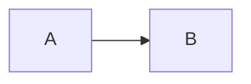

https://web.dev/articles/rendering-performance#1_js_css_style_layout_paint_composite

## The Problem Space

[Sentry](https://sentry.io/welcome/) has a Dashboards feature. A dashboard is a customizable page where users can add charts, tables, and other widgets to visualize their data. One of the widgets is the aptly-named "Big Number", because sometimes you just need a big honkin' number to tell you how many issues you have, or how fast your site is. Nothing gets the job done like a Big Number™. The "big" is unfortunately hiding a lot of complexity, because, how big?


As you can see, it's easy to get it wrong. Sentry only has 6 written values, and one of them is "Pixels Matter", so probably this isn't good enough. What we want is to make the number _exactly as big_ as can fit into the widget.

## The Solution Space

`IntersectionObserver` is a very important API but common hooks around it (e.g., React ARIA) get it wrong. The observer's callbacks receive back the parents dimensions, which means you don't have to re-measure. Measuring the DOM blocks rendering, so it should be done as sparingly as possible

TODO: Verify this re-rendering because of measuring claim

At this point I got a bunch of advice from [Jonas](https://github.com/jonasba)

The algorithm is basically a binary search. It continually evaluates the known bounds and narrows the search space by half until it finds an acceptable match.

The tolerance is very important because it has an outsized impact on the number of required iterations. 10px is easy, and can be done withing 3-4, 5 is 7-8, 1 is 8-10 range. 0 never converges due to rounding in the current algorithm.

As far as I could figure out, there are 3 main approaches to this sort of problem.

### Appoach 1: SVGs

SVGs are naturally scalable, that's what the "S" means. There's surely an easy way to set an `<svg>` element to `object-fit: contain;` inside a parent! SVGs support `<text>`; elements which are selectable with a cursor,and hopefully a screen reader can announce them. This appeals, but scaling text and choosing the correct font size just aren't the same.

Rubik's [type tester page on Google Fonts](https://fonts.google.com/specimen/Rubik/tester) illustrates the point very well. Try changing the font size and you'll see how it changes characteristics slightly at different font sizes. Type designers are very careful about this, especially at small font sizes. The font changes its characteristics subtly to improve legibility. Scaling an SVG does not do this, so the fonts would not look right at large sizes.

There's a subtle related effect where the larger a number is, the tighter the [tracking](https://en.wikipedia.org/wiki/Letter_spacing) has to be, but we'll pretend this isn't a problem for now.

SVGs are a no-go.

### Approach 2: CSS Transforms

A second possibility is using CSS transforms `transform: scale(??)` to scale the text. This would be more complicated because we'd have to calculate the ratio in JavaScript, but it also suffers from the same font scaling problem as SVGs, so it's a no-go.

### Approach 3: Container Queries

https://developer.mozilla.org/en-US/docs/Web/CSS/CSS_containment/Container_queries

[CSS container queries](https://developer.mozilla.org/en-US/docs/Web/CSS/CSS_containment/Container_queries) are widely supported now, and the premise seems helpful: scale the font size according to the container. This doesn't work either because font size controls the _height_ of the font. Plus, we don't know the contents. Plus even if we did (we kind of do), we don't know the exact width of the characters inside! What about multi-line fits? Etc.

### Bonus Approch: `canvas`

4. BONUS: Canvas. There's a way (I hear) to render text to a canvas and use measureText to get the dimensions, but that's fairly complicated

```tsx
interface Props {
  value: number;
}

function AutoText({value}: Props}) {
  return <div>{value}</div>;
}
```

`useLayoutEffect` and "blocking paint". Compositing vs. painting, and blocking paint.

React 18 and `setState` batching and my fears about re-rendering too many times.

Update order, closures, etc. Setting up a dependency. I think I might need a Mermaid diagram here, which is confusing. It re-renders when `fontSize` changes, but the measurement ref is still the previous iteration.

Temptation to start removing dependencies and how that's usually a mistake.



https://overreacted.io/a-complete-guide-to-useeffect/

`MutationObserver` and why that was pointless and didn't work even though I was probably not using it right.

reading the source vs. reading a guide, https://en.wikipedia.org/wiki/Emergence

`requestAnimationFrame` is probably not the thing here (in fact it's the opposite)

blocking the UI thread via iterating in a loop

`useTransition` to mitigate other resize events

the way the browser profile shows one long-ass task

ref callbacks

taking rendering control away from React

the initial API, from Jonas' feedback, guessing the parameters ahead of time, being fearful of the bounds

Probably this should accept a forward ref in the future, to give control over the element inside?

CSS as an API (sketchy)

https://github.com/getsentry/sentry/pull/76209/
