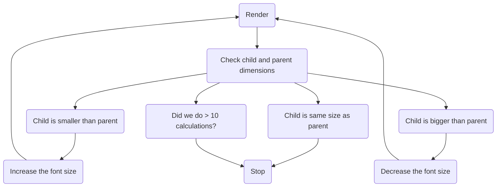

## The Problem Space

[Sentry](https://sentry.io/welcome/) has a Dashboards feature. A dashboard is a customizable page where users can add charts, tables, and other widgets to visualize their data. One of the widgets is the aptly-named "Big Number", because sometimes you just need a big honkin' number to tell you how many issues you have, or how fast your site is. Nothing gets the job done like a Big Number™. The "big" is unfortunately hiding a lot of complexity, because, how big?


As you can see, it's easy to get it wrong. Sentry only has 6 written values, and one of them is "Pixels Matter", so probably this isn't good enough. What we want is to make the number _exactly as big_ as can fit into the widget. This tasks (like a lot of UI tasks) ended up being more complicated than I thought.

Collab with
At this point I got a bunch of advice from [Jonas](https://github.com/jonasba) who gave me a bunch of advice

## The Solution Space

`ResizeObserver` is a very important API but common hooks around it (e.g., React ARIA) get it wrong. The observer's callbacks receive back the parents dimensions, which means you don't have to re-measure. Measuring the DOM blocks rendering, so it should be done as sparingly as possible

TODO: Verify this re-rendering because of measuring claim

The algorithm is basically a binary search. It continually evaluates the known bounds and narrows the search space by half until it finds an acceptable match.

The tolerance is very important because it has an outsized impact on the number of required iterations. 10px is easy, and can be done withing 3-4, 5 is 7-8, 1 is 8-10 range. 0 never converges due to rounding in the current algorithm.

As far as I could figure out, there are 3 main approaches to this sort of problem.

### Appoach 1: SVGs

SVGs are naturally scalable, that's what the "S" means. There's surely an easy way to set an `<svg>` element to `object-fit: contain;` inside a parent! SVGs support `<text>`; elements which are selectable with a cursor,and hopefully a screen reader can announce them. This appeals, but scaling text and choosing the correct font size just aren't the same.

Rubik's [type tester page on Google Fonts](https://fonts.google.com/specimen/Rubik/tester) illustrates the point very well. Try changing the font size and you'll see how it changes characteristics slightly at different font sizes. Type designers are very careful about this, especially at small font sizes. The font changes its characteristics subtly to improve legibility. Scaling an SVG does not do this, so the fonts would not look right at large sizes.

There's a subtle related effect where the larger a number is, the tighter the [tracking](https://en.wikipedia.org/wiki/Letter_spacing) has to be, but we'll pretend this isn't a problem for now.

SVGs are a no-go.

### Approach 2: CSS Transforms

A second possibility is using CSS transforms `transform: scale(??)` to scale the text. This would be more complicated because we'd have to calculate the ratio in JavaScript, but it also suffers from the same font scaling problem as SVGs, so it's a no-go.

### Approach 3: Container Queries

https://developer.mozilla.org/en-US/docs/Web/CSS/CSS_containment/Container_queries

[CSS container queries](https://developer.mozilla.org/en-US/docs/Web/CSS/CSS_containment/Container_queries) are widely supported now, and the premise seems helpful: scale the font size according to the container. This doesn't work either because font size controls the _height_ of the font. Plus, we don't know the contents. Plus even if we did (we kind of do), we don't know the exact width of the characters inside! What about multi-line fits? Etc.

### Bonus Approch: `canvas`

There's a way (I hear) to render text to a canvas and use measureText to get the dimensions, but that's fairly complicated

## The Resizing Algorithm

The crux of the component is the algorithm. Let's talk about how it chooses the font size. Here's a flow diagram of what happens during render (on initial page load, or on resize):



Here's a sample run of the calculation:

- `AutoSizeText` mounts. The font size bounds (`minFontSize` and `maxFontSize`) are provided as 0 and 200 respestively. `fontSize` is set to 100px (the midpoint). It renders the `ChildElement` with a font size of 100px
- `useLayoutEffect` fires. It checks the child element's width, and finds that it overflows the parent. It's too big! It updates the font size bounds to 0px and 100px respectively (100px is too big). It sets the new font size to halfway between the bounds (50px)
- `useLayoutEffect` fires. It checks the elements and finds that the child underflows the parent by a lot. It's too small! It updates the font size bounds to 50px and 100px respectively. It sets the new font size to halfway between the bounds (75px)
- `useLayoutEffect` fires. It checks the elements and find that the child is almost the same size as the parent, within 5px in width. We're done! Stop iterating

This is essentially a [binary search](https://en.wikipedia.org/wiki/Binary_search) for the right dimension. This is obviously more efficient than, say, changing the font size by 1px in the right dimension until it hits the bounds.

It works well! For Sentry dashboard widgets, finding an acceptable fit usually takes about 7 iterations to get a child that's within 5px of the parent.

This result was encouraging, but there were lots of improvement to make. All of the following improvements were suggested by Jonas (thank you Jonas) who is an unstoppable good-ideas-having machine and a resident expert of unusual React rendering strategies.

## Driving UI Renders Through React State

I always try to do things The React Way if I can. The [first version of the component](https://github.com/getsentry/sentry/pull/76209/commits/6a982d0167a0f290eff32bd46524aa72161184a9) stored everything in React state and drove UI updates through state updates. Here's a pseudocode version:

```tsx
function AutoSizedText({ children, minFontSize, maxFontSize, calculationCountLimit }: Props) {
  // Set up state variables for:
  // 1. Parent element height and width
  // 2. The current font size
  // 3. The most recent font size bounds
  // 4. Calculation count

  // Set up refs for:
  // 1. Wrapper of `ParentElement`
  // 2. Wrapper of `ChildElement`

  useResizeObserver({
    ref: parentRef,
    onResize: () => {
      // Reset the font size and its bounds
      // Store the parent width and height in React state
    };
  })

  useLayoutEffect(() => {
    // Get parent and children dimensions
    // Check the difference in parent and child dimensions
    // Run the resizing algorithm
  })

  return (
    <ParentElement>
      <ChildElement>
        {children}
      </ChildElement>
    </ParentElement>
  )
}
```

- Almost everything is driven via React state and `useLayoutEffect`. When `useResizeObserver` runs, it updates the state and triggers a re-render that recalculates the sizes
- only HTML elements are in `ref`s
- The `useLayoutEffect` has a dependency on literally every piece of React state, so it runs on pretty much every render
- each iteration of the resize algorithm updates the state, which triggers another run of the algorithm
- The component uses its own `ParentElement` to wrap the child, for additional control

This, in my opinion, is a natural approach. It uses basic React primitives, generously assigns state, and uses the natural render lifecycle. The only interesting thing, in my opinion is the use of `useLayoutEffect` over `useEffect`. `useLayoutEffect` block browser paint, which is important because we only want to show the numbers after the resizing algorithm runs (more on this later). React 18 [very effectively batches `setState` calls](https://react.dev/blog/2022/03/29/react-v18#new-feature-automatic-batching) so it's not a problem to have a lot of state.

The problem is that using a combination of `useEffect` (the state it reference is from the closure its in) and `useRef` (the state it references is always most recent) caused me some grief, so I had to futz with the code execution order. As often, I referenced [Dan Abramov's "A Complete Guide to useEffect"](https://overreacted.io/a-complete-guide-to-useeffect/) which is my favourite resource on the topic. The trick was having to store the parent element dimensions in `useState` so that every render has a correct reference to the most recent known parent dimensions _and_ the most recent known font size and bounds.

The result was great!


Sidebar: While I was figuring out my ref vs. state issues I started feeling the temptation to remove items from the `useLayoutEffect` dependency array, and had to remember that it's almost universally a bad idea to lie to React about hook dependencies.

### Detour: `useTransition`

`useTransition` is an important thing while doing this sort of thing, a new API available in React 18.

## Driving UI Changes Through `ResizeObserver`

The React state approach was fine, but a better, simpler approach emerged!

```tsx
function AutoSizedText({ children, minFontSize, maxFontSize, calculationCountLimit }: Props) {
  // Set up refs for
  // 1. The current font size
  // 2. The most recent font size bounds
  // 3. Wrapper of `ChildElement`

  useLayoutEffect(() => {
    // Manually set up a `ResizeObserver`
    // Reset the font size bounds
    // Run the resizing algorithm
  }, [])

  return (
    <ParentElement>
      <ChildElement>{children}</ChildElement>
    </ParentElement>
  )
}
```

This version is a little different:

- no state, only refs! The component does _not_ re-render during the resize algorithm. It only re-renders if the props change
- one `ResizeObserver` drives the resize algorithm
- the resize algorithm does not update the React state. It selects a new font size, and updates the DOM manually, avoiding a re-render

### Detour: Delaying Renders

blocking the UI thread via iterating in a loop
https://web.dev/articles/rendering-performance#1_js_css_style_layout_paint_composite

```jsx
while (iterationCount <= ITERATION_LIMIT) {
  // Get child dimenstions
  // Calculate difference between child and parent
  // If the difference is within 1px, stop iteration
  // Update the font size
  // Increase the iteration count
}

// End the iteration
```

The key thing here is the `while` loop. This prevents screen flicker.
Need to make sure the screen didn't flicker.

### Detour: `requestAnimationFrame`

This is not useful in this case, my b.

## Removing `ParentElement`

`ParentElement` is not needed here, to be honest, we can just a native DOM API.

### Detour: `ref` Callback Functions

Another interesting tidbit (again, courtesy of [Jonas](https://github.com/jonasba)) is that React supports [`ref` callback functions](https://react.dev/reference/react-dom/components/common#ref-callback) even in recent versions! A `ref` callback _can_ be an effective way to manage React refs, and in some cases can eliminate code. e.g.,

```jsx
function MyComponent() {
  return <div ref={(node) => {
    if (node) {
      // The component just mounted. This might be a good time to run any just-mounted logic
    } else {
      // If node is `null`, the component just unmounted. This might be a good time to run any cleanup logic
    }
  }}>
}
```

I could have, in theory, dumped a bunch of the mount/unmount logic in the ref callback, but I felt it was less clear than using a `useLayoutEffect` hook where the cleanup logic and re-calculation are clearly expressed.

## Performance

Measuring and re-sizing is a notorious cause of UI thrashing and bad performance. Our approach here was two-fold:

### Local Profiling


### Real User Telemetry

- adding Sentry to measure the actual real times
- checking the iteration counts
- checking the converging criteria

I wouldn't ship a feature like this without some pretty extensive instrumentation. It is _critical_ to know a few things:

1. How fast does the resize iteration run in the wild on real computers?
2. How often and why does the resize iteration fail to converge?

I instrumented the code by wrapping the iteration algorithm in a custom span with a few attributes:

- final difference between parent and child width in pixels
- final difference between parent and child heigt in pixels
- iteration count before fit is achieved

This lets me plot the p50, p95, and p99 of the iteration as well as track any runs that exceeded the iteration maximum.

The results were fascinating! The instrumentation revealed some interesting performance numbers, and also a few bugs.

- p50 is 0.90ms
- p95 is 6.00ms
- p99 is 17.58ms
- p100 is 75.90ms
- the max iteration count is around 10

This performance is acceptable to me. The resize happens fast enough to be imperceptable (faster than 100ms) is all cases. Since the data for the widgets loads async, the UI has to watch for a `fetch()` call before the resize, and compared to the `fetch()` duration, this resize is meaningless.

Success! I can ship, an reduce the max iteration count to 20, just to be generous.
The reality of how this component is used (at least for now) is that it auto-sizes a big number in a dashboard widget. The value of the number is not known at pageload, it's loaded async. The async load can take anywhere from 20ms to 200ms or more, and shows a loading spinner. If the resize happens in under 10ms, it's _so much faster_ than then async load that its performance on page load doesn't matter. It also run on page resize. In my opinion, it does _not_ matter that the resize animation is smooth. In fact, I'm tempted to debounce the resize.

## Components and Their Props

The first iteration of this component had this kind of setup:

```jsx
interface Props {
  minFontSize: number;
  maxFontSize: number;
}

function AutoSizeText(props: Props) {
  const [fontSize, setFontSize] = useState < number > (maxFontSize - minFontSize) / 2

  // More code
}
```

I required a manual minimum and maximum for two reasons:

1. Fear. I had some reservations about running this component without size restrictions. What if the algorithm fails, and the font size drops to 0, or otherwise explodes off the page? This fear is unfounded, IMO. Why would such a thing happen? If it happens, I should fix the condition that caused it.
2. Simplicity. Asking for a manual size restriction makes the code easier to manage because I don't have to calculate the font size bounds myself.

I ended up throwing this out. Requiring manual bounds had too many downsides, and it's a bad api.

First of all, how would developers decide these bounds? Why wouldn't they always set the minimum as `0` and the maximum as some-impractically-large-number? Second of all, it creates unpleasant limits. The problem I ran into immediately is that I set a maximum bound too low, and was then confused why my auto-sized numbers weren't big enough. Third of all, this means there are _two_ APIs. The first API is through CSS, by creating a positioned parent element in HTML. The second API is through React's props. That's no good. I liked the idea of CSS as the main API, so I didn't want to _also_ have a second API to fiddle with.

I ended up setting `minFontSize` to 0, and `maxFontSize` to the height of the parent component. Easy!

## The Final Result

The final result (as of August 26th, 2024) is here:

https://github.com/getsentry/sentry/pull/76209/

TODO: Link to the actual file, or paste the source.

It looks a little different from the original (different how), but the core bits are still there. Probably this should accept a forward ref in the future, to give control over the element inside? Anyway thanks for reading!
