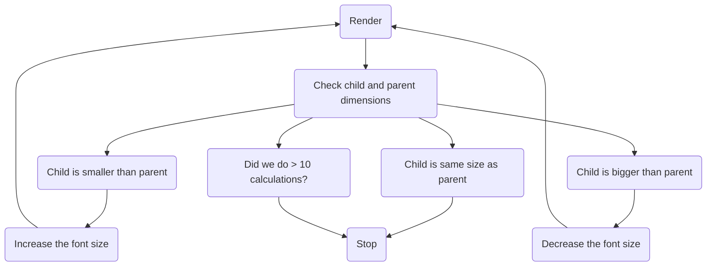

https://web.dev/articles/rendering-performance#1_js_css_style_layout_paint_composite

## The Problem Space

https://github.com/getsentry/sentry/pull/76209/

[Sentry](https://sentry.io/welcome/) has a Dashboards feature. A dashboard is a customizable page where users can add charts, tables, and other widgets to visualize their data. One of the widgets is the aptly-named "Big Number", because sometimes you just need a big honkin' number to tell you how many issues you have, or how fast your site is. Nothing gets the job done like a Big Number™. The "big" is unfortunately hiding a lot of complexity, because, how big?


As you can see, it's easy to get it wrong. Sentry only has 6 written values, and one of them is "Pixels Matter", so probably this isn't good enough. What we want is to make the number _exactly as big_ as can fit into the widget. This tasks (like a lot of UI tasks) ended up being more complicated than I thought.

## The Solution Space

`IntersectionObserver` is a very important API but common hooks around it (e.g., React ARIA) get it wrong. The observer's callbacks receive back the parents dimensions, which means you don't have to re-measure. Measuring the DOM blocks rendering, so it should be done as sparingly as possible

TODO: Verify this re-rendering because of measuring claim

At this point I got a bunch of advice from [Jonas](https://github.com/jonasba)

The algorithm is basically a binary search. It continually evaluates the known bounds and narrows the search space by half until it finds an acceptable match.

The tolerance is very important because it has an outsized impact on the number of required iterations. 10px is easy, and can be done withing 3-4, 5 is 7-8, 1 is 8-10 range. 0 never converges due to rounding in the current algorithm.

As far as I could figure out, there are 3 main approaches to this sort of problem.

### Appoach 1: SVGs

SVGs are naturally scalable, that's what the "S" means. There's surely an easy way to set an `<svg>` element to `object-fit: contain;` inside a parent! SVGs support `<text>`; elements which are selectable with a cursor,and hopefully a screen reader can announce them. This appeals, but scaling text and choosing the correct font size just aren't the same.

Rubik's [type tester page on Google Fonts](https://fonts.google.com/specimen/Rubik/tester) illustrates the point very well. Try changing the font size and you'll see how it changes characteristics slightly at different font sizes. Type designers are very careful about this, especially at small font sizes. The font changes its characteristics subtly to improve legibility. Scaling an SVG does not do this, so the fonts would not look right at large sizes.

There's a subtle related effect where the larger a number is, the tighter the [tracking](https://en.wikipedia.org/wiki/Letter_spacing) has to be, but we'll pretend this isn't a problem for now.

SVGs are a no-go.

### Approach 2: CSS Transforms

A second possibility is using CSS transforms `transform: scale(??)` to scale the text. This would be more complicated because we'd have to calculate the ratio in JavaScript, but it also suffers from the same font scaling problem as SVGs, so it's a no-go.

### Approach 3: Container Queries

https://developer.mozilla.org/en-US/docs/Web/CSS/CSS_containment/Container_queries

[CSS container queries](https://developer.mozilla.org/en-US/docs/Web/CSS/CSS_containment/Container_queries) are widely supported now, and the premise seems helpful: scale the font size according to the container. This doesn't work either because font size controls the _height_ of the font. Plus, we don't know the contents. Plus even if we did (we kind of do), we don't know the exact width of the characters inside! What about multi-line fits? Etc.

### Bonus Approch: `canvas`

There's a way (I hear) to render text to a canvas and use measureText to get the dimensions, but that's fairly complicated

## Iterating on a Solution

### Attempt 1

I always try to do things The React Way if I possibly can. The [first version of the component](https://github.com/getsentry/sentry/pull/76209/commits/6a982d0167a0f290eff32bd46524aa72161184a9) was something like this (content heavily edited for brevity):

```tsx
function AutoSizedText({ children, minFontSize, maxFontSize, calculationCountLimit }: Props) {
  // Set up state variables for:
  // 1. Parent element height and width
  // 2. The current font size
  // 3. The most recent font size bounds
  // 4. Calculation count

  // Set up refs for:
  // 1. Wrapper HTML element
  // 2. Container of the `children`

  useResizeObserver({
    ref: parentRef,
    onResize: () => {
      // Reset the font size and its bounds
      // Store the parent width and height in React state
    };
  })

  useLayoutEffect(() => {
    // Get parent and children dimensions
    // Check the difference in parent and child dimensions
    // Run the resizing algorithm (more on this later)
  })

  return (
    <ParentElement>
      <ChildElement>
        {children}
      </ChildElement>
    </ParentElement>
  )
}
```

There are a few interesting things in this version:

1. Everything is driven via React state and `useLayoutEffect`. When `useResizeObserver` runs, it updates the state and triggers a re-render that recalculates the size
2. The `useLayoutEffect` has a dependency on literally every piece of React state, so it runs on pretty much every render
3. The component uses its own `ParentElement` to wrap the child, for additional control

There were a few interesting other factors.

Firstly, I was afraid that having that many `setState` calls is going to cause a bananas amount of re-renders, but that's not the case. React 18 [very effectively batches `setState` calls](https://react.dev/blog/2022/03/29/react-v18#new-feature-automatic-batching) so this was not an issue.

Secondly, I was afraid that ?? what was this again

Third, I had some problems correctly triggering the resizing in the right order. Using a combination of `useEffect` (the state it reference is from the closure its in) and `useRef` (the state it references is always most recent) caused me some grief, so I had to futz with the code execution order. As often, I referenced [Dan Abramov's "A Complete Guide to useEffect"](https://overreacted.io/a-complete-guide-to-useeffect/) which is my favourite resource on the topic. The result was having to store the parent element dimensions in `useState` so that every render has a correct reference to the most recent known parent dimensions _and_ the most recent known font size and bounds.

This approach looked like it fully worked!


`useLayoutEffect` and "blocking paint". Compositing vs. painting, and blocking paint.

Update order, closures, etc. Setting up a dependency. I think I might need a Mermaid diagram here, which is confusing. It re-renders when `fontSize` changes, but the measurement ref is still the previous iteration.

Temptation to start removing dependencies and how that's usually a mistake.

## The Resizing Algorithm



Here's a sample run:

- `AutoSizeText` mounts. The font size bounds (`minFontSize` and `maxFontSize`) are provided as 0 and 200 respestively. `fontSize` is set to 100px (the midpoint). It renders the `ChildElement` with a font size of 100px
- `useLayoutEffect` fires. It checks the child element's width, and finds that it overflows the parent. It's too big! It updates the font size bounds to 0px and 100px respectively (100px is too big). It sets the new font size to halfway between the bounds (50px)
- `useLayoutEffect` fires. It checks the elements and finds that the child underflows the parent by a lot. It's too small! It updates the font size bounds to 50px and 100px respectively. It sets the new font size to halfway between the bounds (75px)
- `useLayoutEffect` fires. It checks the elements and find that the child is almost the same size as the parent, within 5px in width. We're done! Stop iterating

This is basically a binary search for the right dimension. This is obviously more efficient than, say, changing the font size by 1px in the right dimension which would have been the naive approach.

It works well! For Sentry dashboard widgets, finding an acceptable fit usually takes about 7 iterations to get a child that's within 5px of the parent.

This result was encouraging, but there were lots of improvement to make. All of the following improvements were suggested by Jonas (thank you Jonas) who is an unstoppable good-ideas-having machine and a resident expert of unusual React rendering strategies.

## `MutationObserver`

`MutationObserver` and why that was pointless and didn't work even though I was probably not using it right.

reading the source vs. reading a guide, https://en.wikipedia.org/wiki/Emergence

`requestAnimationFrame` is probably not the thing here (in fact it's the opposite)

blocking the UI thread via iterating in a loop

`useTransition` to mitigate other resize events

the way the browser profile shows one long-ass task

## Perceived Performance

## `ref` Callback Functions

Another interesting tidbit (again, courtesy of [Jonas](https://github.com/jonasba)) is that React supports [`ref` callback functions](https://react.dev/reference/react-dom/components/common#ref-callback) even in recent versions! A `ref` callback _can_ be an effective way to manage React refs, and in some cases can eliminate code. e.g.,

```jsx
function MyComponent() {
  return <div ref={(node) => {
    if (node) {
      // The component just mounted. This might be a good time to run any just-mounted logic
    } else {
      // If node is `null`, the component just unmounted. This might be a good time to run any cleanup logic
    }
  }}>
}
```

I could have, in theory, dumped a bunch of the mount/unmount logic in the ref callback, but I felt it was less clear than using a `useLayoutEffect` hook where the cleanup logic and re-calculation are clearly expressed.

## Component and Their Props

The first iteration of this component had this kind of setup:

```jsx
interface Props {
  minFontSize: number;
  maxFontSize: number;
}

function AutoSizeText(props: Props) {
  const [fontSize, setFontSize] = useState < number > (maxFontSize - minFontSize) / 2

  // More code
}
```

I required a manual minimum and maximum for two reasons:

1. Fear. I had some reservations about running this component without size restrictions. What if the algorithm fails, and the font size drops to 0, or otherwise explodes off the page? This fear is unfounded, IMO. Why would such a thing happen? If it happens, I should fix the condition that caused it.
2. Simplicity. Asking for a manual size restriction makes the code easier to manage because I don't have to calculate the font size bounds myself.

I ended up throwing this out. Requiring manual bounds had too many downsides, and it's a bad api.

First of all, how would developers decide these bounds? Why wouldn't they always set the minimum as `0` and the maximum as some-impractically-large-number? Second of all, it creates unpleasant limits. The problem I ran into immediately is that I set a maximum bound too low, and was then confused why my auto-sized numbers weren't big enough. Third of all, this means there are _two_ APIs. The first API is through CSS, by creating a positioned parent element in HTML. The second API is through React's props. That's no good. I liked the idea of CSS as the main API, so I didn't want to _also_ have a second API to fiddle with.

taking rendering control away from React

## Future Work

Probably this should accept a forward ref in the future, to give control over the element inside?

CSS as an API (sketchy)
