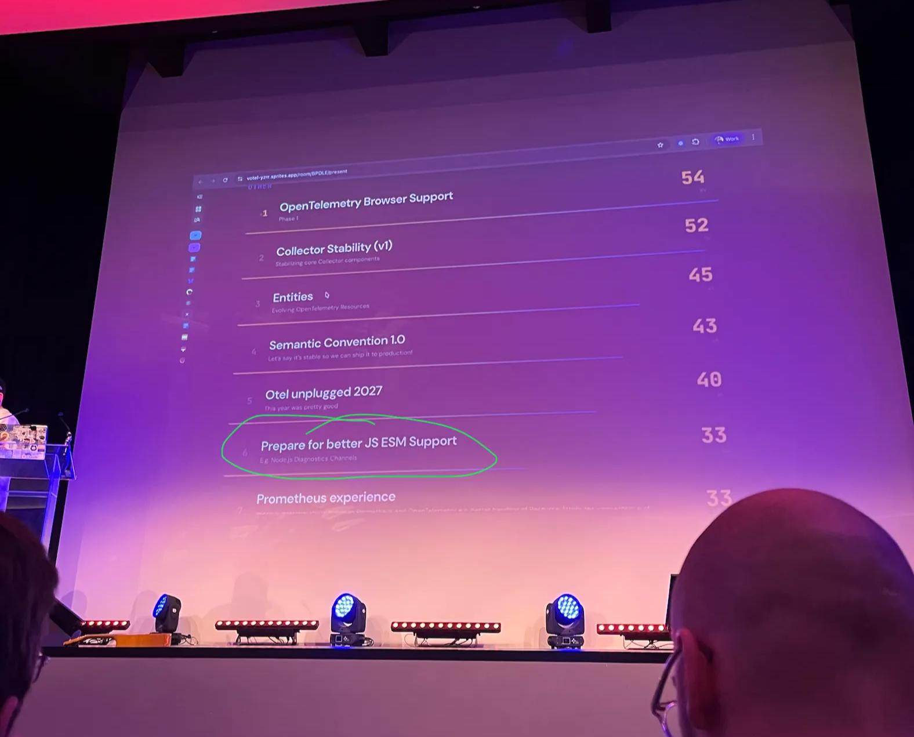

Almost every production application uses a number of different tools and libraries. Be it a library to communicate with
a database, a cache, or frameworks like Nest.js or Nitro. To be able to observe what’s going on in production,
application developers reach out for Application Performance Monitoring (APM) tools like Sentry. But there’s an inherent
problem: the performance data that APM tools need is most often not coming natively from the library itself. Getting
this data is delegated to APM tools like Sentry or OpenTelemetry, which instrument crucial functionality of a library on
their behalf.

## What Is Instrumentation?

The most fundamental requirement to make an application observable is the ability to instrument each of its components
and used libraries. Instrumentation is the process of adding code to a program to monitor and analyze its internal
operations and generate diagnostic data. It’s exactly what the Sentry SDKs and OpenTelemetry instrumentation are doing
under the hood.

Consider a typical HTTP client library. Application developers want to know when a request starts and completes, along
with some metadata like URL, status code and headers. Today, libraries handle this inconsistently: some provide custom
hooks like `emitter.on('request', ...)`, others offer vendor-specific middleware to intercept requests. In these cases,
Sentry and OpenTelemetry can write plug-ins that emit observability data.

This works, but it puts the burden on the library or framework (e.g. Nuxt) to consciously design an instrumentation API
and identify the right places to expose it. Hooks and interceptors allow injecting observability code at the correct
spots, but APM maintainers are entirely dependent on library authors to keep those APIs stable over time. On top of
that, there is no shared convention (each library exposes different hook shapes and different metadata) so APM
maintainers must write and maintain very different plugins for each library.

## How server-side JavaScript is instrumented

The traditional approach to JavaScript instrumentation is “monkey-patching”. That’s modifying library code at runtime so
that library functions not only do their original job, but also emit observability data. This is only possible in
CommonJS (CJS), where modules are mutable and synchronously loaded.

However, the ecosystem is shifting. As server-side JavaScript moves further toward ES Modules (ESM), this approach
breaks down. ES modules are immutable and loaded asynchronously, which means you simply can't patch imports at runtime
the same way anymore. For further information: the [ESM Observability Instrumentation Guide](https://github.com/getsentry/esm-observability-guide) covers this topic in greater detail.

The current workaround (and a way to “patch” imports) is using Module Customization Hooks paired with the `--import`
flag. A popular hook is `import-in-the-middle/hook.mjs`. It works, but it's brittle, complex, and feels like what it is:
a workaround.

Both monkey-patching in CJS and Module Customization Hooks in ESM share the same fundamental flaw: they apply
instrumentation “_from the outside”._ The library itself is passive. The question worth asking is: **what if libraries
were active participants in their own observability and emit telemetry data themselves?** This would be possible through
diagnostics APIs like Tracing Channels.

## Libraries Should Emit Their Own Telemetry

Rather than waiting for APM tools to reach in and grab data, libraries can proactively expose their internal operations
using tools built directly into the runtime. The right tool for this is **Diagnostics Channels**, and more specifically,
**Tracing Channels**.

### Diagnostics Channels

[Diagnostics Channels](https://nodejs.org/api/diagnostics_channel.html) are a high-performance, synchronous event system built directly into Node.js. They're also supported
in Bun, Deno, and Cloudflare Workers (via the Node.js compatibility flag), making them a cross-runtime primitive.

Their primary use case is one-off events. For example, "a connection was opened" (like
`node-redis` [does this here](https://github.com/redis/node-redis/blob/41c908e6d65419fed6d985a9664427df1f48fb98/docs/diagnostics-channel.md?plain=1#L45-L48)).
The limitation is that they don't inherently represent a full lifecycle. You have to manually link `start` and `stop`
events to measure duration.

### Tracing Channels

[Tracing Channels](https://nodejs.org/api/diagnostics_channel.html#class-tracingchannel) solve exactly that limitation. A Tracing Channel is a bundle of related Diagnostics Channels that
automatically creates sub-channels for a complete operation lifecycle: `start`, `end`, `error`, and `asyncStart`. More
importantly, a `TracingChannel` automatically propagates context across async boundaries. This means APM tools can
correlate a database query back to the incoming HTTP request that caused it, without any manual bookkeeping.

Together, they give library and framework authors a standardized way to expose internal operations without coupling to
any specific logging or tracing vendor. The library emits structured events and observability tools decide what to do
with them.

## How Libraries Can Implement Tracing Channels

Tracing Channels have essentially zero cost when unused. If no subscriber is listening, emitting data costs almost
nothing. It means library authors can add tracing channels without worrying about penalizing users who don't need
observability. The benefits are that there is no monkey-patching needed anymore and it eliminates the need for users to
pass `--import` flags for preloading in ESM.

### Naming and Consistency: The Channel Is the Contract

Tracing Channels should always be scoped to the library that emits them, using the npm package name as the namespace.
Since package names are globally unique, this keeps channel names collision-free. For example, `mysql2` ships
`mysql2:query` which would emit `tracing:mysql2:query:start` and all other channels. And the `unstorage` library ships
`unstorage.get` which emits `tracing:unstorage.get:start` and so on. The [
`untracing`](https://github.com/unjs/untracing) package is working to establish broader naming standards across the
ecosystem.

Equally important: Always emit a consistent data structure. Sentry and other APM tools can only provide automatic
instrumentation if they know what shape your payload will have.

The pattern itself is straightforward. The library wraps its operation in a `tracePromise` call:

```jsx
// Library side (e.g. inside ioredis)
import dc from "node:diagnostics_channel";

const commandChannel = dc.tracingChannel("ioredis:command");

// In the command execution path:
commandChannel.tracePromise(
  async () => {
    return await executeCommand(cmd);
  },
  { command: cmd.name, args: cmd.args },
);
```

And on the consumer side, an SDK like Sentry subscribes to those events:

```jsx
// Consumer side (e.g. Sentry SDK)
import dc from "node:diagnostics_channel";

dc.tracingChannel("ioredis:command").subscribe({
  start(payload) {
    // create span
  },
  asyncEnd(payload) {
    // finish span
  },
  error({ error }) {
    // record error
  },
});
```

The library and the observability tool never need to know about each other. The channel is the contract.

## The Ecosystem Is Already Moving

In early February 2026, we ([Andrei](https://github.com/andreiborza), [Jan](https://github.com/JPeer264) and [Sigrid](https://github.com/s1gr1d)) from Sentry
attended [OTel Unplugged EU](https://opentelemetry.io/blog/2025/otel-unplugged-fosdem/) and brought up the topic
“Prepare for better JS ESM Support”, which was voted on the list of top priorities for the OpenTelemetry ecosystem.



So this isn't a theoretical proposal. A growing number of well-known libraries have already shipped or merged PRs for
Diagnostics Channel and Tracing Channel support.

On the framework and HTTP side, `undici` (Node.js's built-in HTTP client)
has [shipped Diagnostics Channels](https://undici-docs.vramana.dev/docs/api/DiagnosticsChannel) since Node 20.12, and
also `fastify` ([docs](https://fastify.dev/docs/latest/Reference/Hooks/#diagnostics-channel-hooks)), `nitro` ([PR](https://github.com/nitrojs/nitro/pull/4001)) and
`h3` ([PR](https://github.com/h3js/h3/pull/1251)) have native support. On the database side,
`unstorage` ([PR](https://github.com/unjs/unstorage/pull/707)) and `mysql2` ([Docs](https://sidorares.github.io/node-mysql2/docs/documentation/tracing-channels)) already use Tracing Channels,
and `pg` / `pg-pool` are actively working on it. Redis clients aren't far behind either and already support Tracing
Channels in `ioredis` ([PR](https://github.com/redis/ioredis/pull/2089)) and
`node-redis` ([PR](https://github.com/redis/node-redis/pull/3195)).

None of this happens without the people willing to do the work. A massive shoutout to Sentry engineer **Abdelrahman Awad** ([@logaretm](https://github.com/logaretm))
for driving Tracing Channel implementations across multiple libraries. And
a special thanks to **Pooya Parsa** ([@pi0](https://github.com/pi0)), his openness to collaborate in `h3` and `nitro` was
instrumental in formalizing this approach and showing the ecosystem what it could look like.

## The Vision Ahead

We're still in a "chicken and egg" phase. Libraries need to add channels before APM tools have strong reasons to listen
to them, and APM tools need to start listening before authors feel the pressure to add them.

The goal is **universal JS observability**: a world where Node.js, Bun, and Deno share the same diagnostic patterns, and
instrumentation just works without monkey-patching in CJS, without `--import` flags in ESM, and without fragile
workarounds. Libraries become active drivers of observability ensuring they are emitting data they think is the most
relevant to their users.
