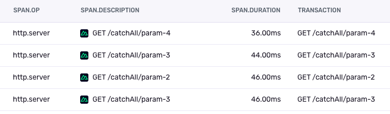
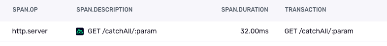
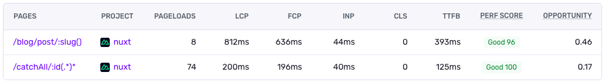

Ever deployed a change to a dynamic route like `user/[userId]` and then checked your Sentry dashboard, only to find a huge number of differently named path names? You see they have the same problem over and over: super long trace durations, but for `/users/123`, `/users/456`, `/users/789`, and so on. You figure it’s the same root problem, but every unique URL from each user is seen as standalone, making it impossible to see the real impact.



This is where **route parametrization** comes in. It’s when the Sentry SDKs figure out the original dynamic route names so the Sentry dashboard can use the parametrized route (like `users/[userId]`). This makes it possible to group the events of one dynamic page together with a single query.



This article will cover different strategies our SDKs use to find the "true" route name across various frameworks.

## What is a Parametrized Route, Anyway?

Most frameworks and router libraries let you define **dynamic routes** with path patterns like `article/[slug]` or `article/:slug`. The Sentry SDK, however, initially grabs the full URL, like `article/hello-world`. The SDK then attempts to identify the original dynamic route, which is the **parametrized route**.

## Where Parametrized Routes are Helpful

Route parametrization is more than just a convenience; it fundamentally improves how you monitor and debug your applications. The **high** **cardinality** of URL-based traces—where each unique URL is treated as a distinct entity—can make it nearly impossible to identify systemic issues. Route parametrization reduces this cardinality, providing a clearer, more aggregated view of your application's health.

For instance, Sentry's **Discover** and **Explore** features like the **Trace Explorer** become far more powerful. You can simply query for `/users/[userId]` to see a consolidated view. This approach gives you a complete picture of the page's performance and stability, whether you're analyzing error trends or investigating slow database queries. Furthermore, Sentry’s **Web Vitals insights** depend on the route name. By using parametrized routes, you can see aggregated Web Vitals data for a single dynamic page.



## The Journey to Route Parametrization in All SDKs

For a long time, automatic route parametrization in our Sentry JavaScript SDKs was only possible when a framework's router easily exposed the route name. This meant we couldn't offer a unified, consistent experience across different JavaScript frameworks and libraries. Although Sentry’s **Relay** has a best-effort route parametrization feature that uses heuristics to guess route names after events were sent, it is limited. Its dependency on heuristic means it can never be 100% certain about what was a dynamic route segment versus a static one.

Over time, both our tooling at Sentry and the frameworks themselves have evolved. Frameworks introduced new APIs that gave us better access to route information. Concurrently, Sentry built more powerful tools, such as the **Sentry Bundler Plugins**, which gave us greater control over the build process. This allowed the SDKs to inject and access crucial information at build time.

Now, instead of just hoping a framework's router would expose the route name, we can combine these advancements to reconstruct the "true" route name. This means you can now get consistent, high-quality route parametrization, regardless of your JavaScript stack, with new improvements available for **Next.js**, **Nuxt**, and **Astro** SDKs.

## **Strategies for Finding the True Route Name**

Finding the parametrized route isn't always straightforward. Our SDKs use a few clever strategies, from simple API calls to some serious detective work.

### Strategy 1: Just Ask the Router

In the best-case scenario, the framework's router knows the parametrized route and exposes it. For example, with `react-router`, you define a route like `<Route path=":city" ... />`. The library makes the route object available, and the Sentry SDK can simply grab the path property to name the transaction.

This is the simplest and most reliable method, as no extra processing is needed.

### Strategy 2: Use a Build-Time Manifest With RegEx Matchers

This approach is perfect for file-based routers like Next.js. At build time, the SDK has access to the application's entire directory structure. It uses this to create a route manifest that contains all static and dynamic routes. Some frameworks already include such a route manifest, which can directly be used by the Sentry SDKs. In the case of Next.js, the Sentry SDK creates such a manifest.

Dynamic routes in the manifest include regular expressions to match against concrete URLs at runtime. For example, a request to `blog/hello-world` would be matched against the pattern `^/blog/([^/]+)$` to identify it as `/blog/:slug`. The manifest looks something like this:

```jsx
{
   staticRoutes: [
       { path: '/' },
       { path: '/blog/home' }
   ],
   dynamicRoutes: [
       {
          path: '/blog/:slug',
          regex: '^/blog/([^/]+)$',
          paramNames: ['slug'],
       },
   ]
}
```

This manifest is bundled with the app, making route data created at build time available during runtime.

### Strategy 3: Recreate the Route with Runtime Clues

Sometimes, the SDK needs to play detective at runtime and reconstruct a route. In Astro, for example, our server middleware can inspect the request context. This context includes a `routes` array ([Astro type here](https://github.com/withastro/astro/blob/951897553921c1419fb96aef74d42ec99976d8be/packages/astro/src/core/app/types.ts#L56)) with information about the accessed route. For `posts/[postId]`, it looks like this:

```jsx
// Array items for route: posts/[postId]
([{ content: "posts", dynamic: false, spread: false }],
  [{ content: "postId", dynamic: true, spread: false }]);
```

With the name and type ("dynamic" or not) of each segment, the SDK can easily stitch them back together to reconstruct the full parametrized route during runtime.

### Strategy 4: Hybrid: Use Build-Time and Runtime Data together

Sometimes, we need to combine information from both build and runtime to be able to reconstruct a parametrized route. Nuxt is a great example of this.

During the build, the SDK gets a list of all pages and their parametrized paths:

```jsx
[
  { file: "/a/directory/pages/some/path", path: "/some/path" },
  { file: "/a/directory/pages/some/other/path", path: "/some/other/path" },
  { file: "/a/directory/pages/user/[userId].vue", path: "/user/:userId()" },
];
```

This data is then added as a virtual file using Nuxt's `addTemplate` function. This makes the build-time route information available to the server at runtime.

Then, at runtime, the Nuxt server provides a list of all modules that were used to render the incoming request:

```jsx
// SSR Context modules for user/[userId]
Set(["app.vue", "components/Button.vue", "pages/user/[userId].vue"]);
```

Neither piece of information is enough on its own. The build-time data has the parametrized path we want, but we don't know which one to pick. The runtime data tells us which page file was used, but not its parametrized path. By matching the file path from the runtime context against the list from the build, the SDK can confidently identify the correct parametrized route.

## **Bridging Environments: From Server to Client**

Often, the route is discovered on the server but is needed to instrument page loads in the browser. For Server-Side Rendered (SSR) pages, the server can determine the parametrized route and inject it directly into the HTML `<head>` using a meta tag.

```html
<meta name="sentry-route-name" content="/users/[id]" />
```

When the Sentry SDK initializes in the browser, it reads this meta tag to correctly name the initial page-load transaction.

## Conclusion: Smarter Issue Querying, Faster Fixes

Route parametrization is the key to turning a noisy, overloaded issue stream into a clean, actionable list. By converting specific URLs like `/users/123` into their generic templates like `/users/[id]`, you can query errors and performance issues intelligently.

Our SDKs achieve this using a variety of techniques tailored to each framework, whether it's by asking the router directly, using a build-time manifest, or combining clues from different stages of the application lifecycle. Ideally, the frameworks already provide easy access to the parameterized route name.

The result? Spending less time trying to figure out the impact of an issue and more time fixing it.
