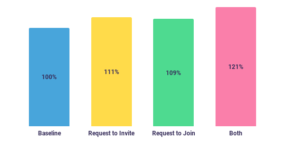

At its core, Sentry is a tool that alerts you to defects in your production software. But it does more than blast stack traces into your inbox: Sentry provides powerful workflows to help your team determine root cause, [triage issues](https://blog.sentry.io/2019/02/07/sentry-workflow-triage) to your team, and keep tabs on ongoing concerns with comments and notifications.

These collaborative features can help you resolve problems with your software quickly. But the keyword here is **collaborative**; without your full team having access to Sentry, you may find yourself quickly becoming overwhelmed with an endless backlog of issues and no one to help.

At the end of 2019, the Growth team made it our mission to make it easier for our users to invite their teammates to join them on Sentry. To achieve this, we tackled three distinct areas:

1. Surfacing the ability to invite users contextually
2. Expanding Sentry’s permission model to allow more _types of users_ to send invitations
3. Allowing external users to request access themselves

Our theory: improving the user experience of inviting users, as well as democratizing the process to include all team members would lead to a significant increase in team-wide adoption. (_Narrator: it did._)

## The status quo

Before we get deep into what we changed and how it impacted the bottom line, let’s quickly revisit how user invitations worked: the _Add Member to Organization_ page you see below.

This full-page experience, tucked away deep in Sentry’s account settings, had a number of issues:

1. Since this is a full page, reaching it meant you would be taken out of context of whatever you were doing previously
2. Its location deep in our navigation hierarchy meant discoverability was poor
3. It’s unclear you can actually invite multiple people at once (you can!)
4. When inviting multiple users, you could only assign the group to the same role and collection of teams

Interestingly, to improve discoverability, we had previously introduced a number of “quick links” to reach this page more easily. But these links were scattered around the application, and didn’t appear contextually when users signaled intent to invite members.

These user experience and discovery challenges felt like obvious starting places. But instead of just settling for a new “improved” form, we decided to rethink the entire experience from the ground up.

## The new member invitation modal

It’s probably not a surprise that our first instinct was to convert this page into a modal – one that manages to squeeze all of the capabilities shown earlier into a smaller, more concise experience. It actually does one better: the modal is clearer in indicating that you can invite multiple users, and allows you to set unique permissions for each invitee.

While modals are sometimes overused in web applications, we believed this approach would solve our key discoverability and navigation concerns: it can be shown contextually without leaving the current page, and completing the form returns you to what you were doing.

To that point, we additionally introduced buttons to launch this _Invite New Members_ modal contextually throughout Sentry:

- Viewing an issue and notice a [suspect commit](https://docs.sentry.io/workflow/releases/?platform=node#after-associating-commits) made by a coworker? If they’re not already part of your Sentry organization, you can now invite them then and there.
- Trying to assign an issue to a team member, but don’t see their name in the assignee list? You now have the option to invite them right in the dropdown.
- Creating a new team? Now you can invite new members directly to that team as you go.

_Example contextual link that launches the Invite New Members modal_

## Democratizing invitations

As we began rolling out our new _Invite New Members_ experience across the application, we came to a sobering realization: only roughly **half** of Sentry users could actually use our new modal. That’s because historically, only those with Owner or Manager-level permissions could invite other team members. Combined, users with these permissions accounted for less than 50% of active users.

Restricting the ability to add new users to account administrators is pretty common practice for software tools, and Sentry is no exception. When an employee onboards on a new team, it’s common to see an exchange like this:

> Alice: Oh awesome, we use Sentry. Can you add me to the organization? Bob: Ah, I can’t invite you. Maybe ask Jen?

In a perfect world, one of your administrators is tracked down, and they manually add the new teammate to the account. But sometimes that person is unknown, or is on a vacation, or maybe it takes them days or weeks or even months.

We began asking ourselves: what if we could unlock team members to fast-track this whole process and invite members themselves? This led to our next major change: updating our permission model to allow for **members to request to invite other members**.

Now, when non-administrators open up the Invite New Members modal, it changes contextually to become a “request to invite” rather than a direct invitation. Hitting “send” kicks off an email to all organization administrators, who are prompted to approve any outstanding requests.

_Organization owners and managers can see pending invitation requests._

At this point, we had built what we thought was a fantastic new user experience and we just doubled the number of users who could take advantage of it. But this exercise of opening up user invitations got us thinking: what if there was an even further source of untapped users we weren’t reaching?

## Removing the middleman entirely

In the last section, we highlighted a scenario where one teammate asks another teammate for access to Sentry. And because of our recent changes, users can request to invite their teammates themselves instead of having to track down and ask their account administrator.

But this scenario still has a gatekeeping element: the new teammate has to ask another teammate for access. What if the new teammate spots an alert from Sentry in Slack stemming from their recent changes, and no one’s around to grant them access? Unfortunately, they’d land on an authentication wall that would prevent them from going any further.

This begged the question: was there an untapped source of potential users we weren’t reaching by restricting invitations _only_ to active Sentry users? What if new users didn’t have to ask anyone at all?

So, to keep this party going, we dug in and additionally made it possible for **external users to request to join an organization**.

_The “Request to Join” button has been added to the organization login page, allowing_
Now when a user lands on an Organization’s login page, they have the option to “Request to join”, which asks for the user’s name and email address. Once they hit send, the organization owners are sent an email that prompts them to approve the join request. Just in case, there’s also a call-to-action to disable the feature entirely for their organization.

Having developed a new contextual invitation modal and a pair of invite-friendly permission changes, we were feeling confident that these changes were going to have a strong impact on user behavior. It was time now to put our money where our code was, and verify that all this hard work actually moved the needle.

## A/B testing the impact

Our standard procedure for validating the efficacy of product changes is through A/B testing (also known as split testing). This means instrumenting our application code to serve different experiences to segments of users over the same time period, and comparing the results. This step takes extra effort, but it’s worth it – the alternative is to settle for a before-and-after snapshot of data, which is too easily impacted by external factors like seasonality or marketing pushes.

ℹ️ _To learn more about how we perform A/B testing at Sentry, please see [this earlier blog post](https://blog.sentry.io/2019/05/09/easy-ab-testing-with-planout)._

It’s easy to get carried away with A/B testing, and having so many permutations that you don’t have enough data to be statistically significant. So, to simplify things, we decided that all treatments would get the new modal experience, and our “treatment” groups would focus on the new permission changes.

This left us with 4 distinct treatments that we rolled out to 4 equally-sized customer segments:

1. **Baseline** (new modal only)
2. **Request to Invite** (user invites another user)
3. **Request to Join** (external user requests to join)
4. **Both** Request to Invite and Request to Join are enabled together

Our main criteria for determining success: which of these treatments would result in **an increase in accepted invitations** (and thus new users)?

_% of accepted invitations relative to baseline_

After 30 days, the results became clear (not to mention, statistically significant):

- **11%** more users accepted invitations in the _Request to Invite_ treatment vs. the baseline
- **9%** more users accepted invitations in the _Request to Join_ treatment vs. the baseline
- **21%** more users accepted invitations who had both _Request to Invite_ and treatments enabled

It’s probably not a surprise that allowing a wider set of users to invite team members resulted in more users inviting team members. It’s also probably not a surprise that enabling both feature sets at the same time was even better (given that they complement each other)!

## Turning users into active users

Having more users join your platform is great, but what’s the point if those users never actually use the product? To be truly confident our changes were successful, we need to additionally make sure that invitees in the treatment groups were actually using Sentry.

Internally, we view “active users” as those who meaningfully interact with the product within a 30 day period (vs. just signing in) – for example, viewing or triaging an issue. In the baseline treatment, users became active after accepting an invitation at a rate of 71.3%. In the remaining treatment groups, that number ranged from 72.7% to 78.4%.

_% of users who become active in Sentry within 30 days after accepting an invitation_

The first interesting observation is that despite us making it easier to invite users, overall acceptance rate of invites _actually went up_. This bucks the trend of conversion optimization projects improving metrics in one part of the funnel at the expense of other metrics further down the funnel. This can be attributed to more _qualified users_ being invited in the new flows.

The second observation is that the _Request to Invite_ variant significantly outperformed the other variants. Our guess is that this is because members inviting their teammates to collaborate is one of the best ways to acquire new engaged users.

## Rolling it out and final thoughts

Having accumulated enough data to feel confident in our results (and to publish the data above), we recently turned off our A/B tests and rolled out these changes to all organizations. If you’re a Sentry user on _any_ organization, you’ll now find these new contextual invite links and invite-friendly permission changes available to use.

What began as a simple project to improve our invitation UX expanded to include meaningful permission changes that significantly improved the rate at which new users both join and use Sentry. We didn’t deploy any trickery or “growth hacks” to achieve these results; we just made the product better by getting out of the way of the user and letting them solve their own problems. As product developers, it doesn’t get more satisfying than that.

_This project was a combined effort from our multi-disciplinary Growth team: Evan Purkhiser (Software Engineer), Megan Heskett (Software Engineer), John Manhart (Designer), AJ Jindal (Head of Growth), and Adhiraj Somani (Product Manager)._
