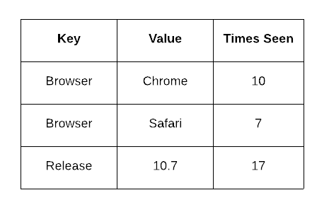

For most of 2018, we worked on an overhaul of our underlying event storage system. We’d like to introduce you to the result of this work — Snuba, the primary storage and query service for event data that powers Sentry in production.

Backed by [ClickHouse](https://clickhouse.yandex/), an open source column-oriented database management system, Snuba is now used for search, graphs, issue detail pages, rule processing queries, and every feature mentioned in our push for [greater visibility](https://blog.sentry.io/2019/03/06/new-features-greater-visibility).

## Why Snuba?

Sentry already ran on abstract service interfaces named Search, Tagstore (for event tags), and TSDB (time series database, powering the majority of graphs). Each of these services had their own production implementations backed by standard relational SQL (for Search and Tagstore) and Redis (for TSDB), which served Sentry well for many years.

Our issues began as Sentry scaled its customer base and engineering team. On one hand, we received more events per second every day. On the other, we had more engineers trying to work on more features for Sentry.

The increase in event volume meant we had to denormalize a lot of data so that known queries could be done very quickly. For example, Tagstore was made of five different tables, recording values like a `times_seen` count per tag value per issue on Sentry (one of your issues might have a tag `browser.name` with a value `Chrome` with a `times_seen` of `10`, and a value `Safari` with a `times_seen` of `7`). Increments to these denormalized counters were buffered so we could coalesce them, ultimately decreasing write pressure.



_Decreasing write pressure by buffering increments to denormalized counters_

This served us well until we wanted to [add a new dimension to query by](https://blog.sentry.io/2018/05/22/introducing-sentry-9), such as `environment`. Refactoring the existing data layout to denormalize on an entire new dimension took us months and required a full backfill of all event data.


_Adding the environment dimension meant refactoring the existing data layout, which caused issues._

It was clear to us that we needed a flat event model that Online Analytical Processing (OLAP) provides, a model that we could query ad-hoc without any denormalization. It needed to be fast enough to serve user requests and not require backend overhauls when we wanted to add another way for users to look at their data.

At the time, Facebook’s columnar store [Scuba](https://research.fb.com/publications/scuba-diving-into-data-at-facebook/) was on our minds because it solves similar problems, but it is closed source. We needed a name for our team and project, and since we weren’t as mature as Scuba, [Snuba](https://en.wikipedia.org/wiki/Snuba) (a portmanteau of “snorkel” and “scuba”) was born.

## Why not just shard Postgres?

Great question, reader. In the short-term, we did.

The primary dataset responsible for aggregating and supplying tag counts (dubbed “Tagstore”) was reaching a point where the number of mutations executed exceeded our ability to replicate them on a single Postgres machine. We scaled that out to a fleet of machines but were burdened with a suite of problems that throwing hardware at just could not resolve. We needed a way to reduce infrastructural work whenever a new dimension of data was discovered, not a way to scale the current dataset. Despite our expertise in Postgres, we came to the decision that it was time to branch out into OLAP systems.

Among a lengthy list of reasons to switch to an OLAP, here are some of our favorites:

1. Our data is immutable, for the most part. Safety mechanisms employed by Multiversion Concurrency Control were not useful for us and ultimately diminished our performance.
2. Counting another dimension of data or introducing another shape of query from the product meant writing new indices and new prayers to the Postgres Query Planner to leverage them.
3. Removing data that has expired past our retention windows meant issuing expensive queries to bulk delete rows.
4. The tides of incoming and outgoing rows took a toll on the Postgres main heap. IO was wasted on combing over dead rows to find the living, and the disks that hosted these databases were slowly but steadily growing in size.

## Why ClickHouse?

We investigated a number of databases in the OLAP scene, including: [Impala](https://impala.apache.org/), [Druid](http://druid.io/), [Pinot](https://dbdb.io/db/pinot), [Presto](https://aws.amazon.com/big-data/what-is-presto/), [Drill](https://drill.apache.org/), [BigQuery](https://cloud.google.com/bigquery/), [Cloud Spanner](https://cloud.google.com/spanner/), and [Spark Streaming](https://spark.apache.org/streaming/). These are all very capable systems under active development, and the specific pros and cons of each have probably changed since early 2018. We ultimately chose ClickHouse after having engineers on the newly-formed Search and Storage Team individually prototype what Snuba could look like on top of the various systems.

Here’s why ClickHouse came out on top:

1. It’s open source. We’re open source. Choosing a proprietary solution would turn a cold shoulder to everyone who runs Sentry outside of our domain.
2. It’s operationally simple in both the scale-up and the scale-down. It does not inherently require any additional services, and only introduces ZooKeeper as a means of replication control. Once we understood its deployment, it took a day to begin writing Sentry’s entire event volume into a single cluster.
3. Rows are sorted based on a primary key, and columns are individually stored and compressed in physical files. This enabled the data behind Tagstore to go from terabytes to gigabytes on disk.
4. Data can be queried as soon as it is written in real time. The ability to consistently read what was just written enabled us to move all of the queries that power [Alert Rules](https://sentry.io/_/resources/customer-success/alert-rules/) to Snuba, which account for roughly 40% of the queries issued per second.
5. There’s no magic of a query planner. If we want to optimize a query pattern, the solutions that ClickHouse provides are few but potent. Most importantly, their ability to provide a [PREWHERE](https://clickhouse.yandex/docs/en/query_language/select/#prewhere-clause) clause enables us to skip a vast amount of data due to strong filtration conditions.

## Inside Snuba

[Snuba](https://github.com/getsentry/snuba) is a two-part service that was designed to abstract ClickHouse away from Sentry. Besides application code and ClickHouse, we’ve leveraged a few other helping services in order to complete the flow of Sentry’s event data.


### Reading

Snuba’s query servers are powered by a Flask web service that uses a JSON schema to provide a rich query interface to Sentry developers. By providing a Snuba client rather than using ClickHouse SQL directly, we can hide a lot of underlying complexity from application developers. For instance, this Snuba query which fetches the most popular tags sent to a project over the past 24 hours:

```json
{
  "project": [1],
  "aggregations": [["count()", "", "count"]],
  "conditions": [["project_id", "IN", [1]]],
  "groupby": ["tags_key"],
  "granularity": 3600,
  "from_date": "2019-02-14T20:10:02.059803",
  "to_date": "2019-05-15T20:10:02.033713",
  "orderby": "-count",
  "limit": 1000
}
```

is translated into this corresponding ClickHouse-flavored SQL query:

```sql
SELECT
    arrayJoin(tags.key) AS tags_key,
    count() AS count
FROM sentry_dist
PREWHERE project_id IN 1
WHERE (project_id IN 1)
    AND (timestamp >= toDateTime('2019-02-14T20:10:02'))
    AND (timestamp < toDateTime('2019-05-15T20:10:02'))
    AND (deleted = 0)
GROUP BY tags_key
ORDER BY count DESC
LIMIT 0, 1000
```

Presenting this higher level Snuba query interface — rather than encouraging application developers to interact with ClickHouse directly — enables our team to keep changes to the underlying data model within Snuba itself instead of requiring developers to constantly change their queries as we iterate.

Also, we now make centralized changes that affect a wide variety of different query patterns. For example, we use Redis to cache individual query results, which coalesces some of our more bursty and frequently repeated queries into a single ClickHouse query and removes unnecessary load from the ClickHouse cluster.

### Writing

Writing to Snuba starts with reading from a Kafka topic of JSON events that have gone through Sentry’s normalization and processing steps. It processes events in a batch, turning each event into a tuple that will map to a single ClickHouse row. Inserting into ClickHouse in batches is critical because each insert creates a new physical directory with a file for each column and a corresponding record in ZooKeeper. These directories are merged by a background thread in ClickHouse, and it’s recommended that you write approximately once per second so there aren’t too many writes to ZooKeeper or files on disk to deal with. Data is [partitioned](https://clickhouse.yandex/docs/en/operations/table_engines/custom_partitioning_key/) by time and retention window, allowing us to easily remove any data that has gone beyond its original retention window.

---

Of course, this is only a brief overview of the things that the Search and Storage Team has accomplished over the past year. We look forward to sharing more of the process, including how we dark launched and compared performance and similarity of existing queries with Snuba for months before we shipped, neat performance shortcuts to take on some types of query, how we handle query consistency for rule-based alerting, and how we are mutating data.

In the meantime, check out the new Snuba powered features, like the [Events View and Discover](https://blog.sentry.io/2019/03/06/new-features-greater-visibility).

_Before you go, we’d like to profusely thank the Sentry Engineers that worked tirelessly to create and hone Snuba (and took the time to write this fantastic blog post): Brett Hoerner, Ted Kaemming, Alex Hofsteede, James Cunningham, and Jason Shaw._
