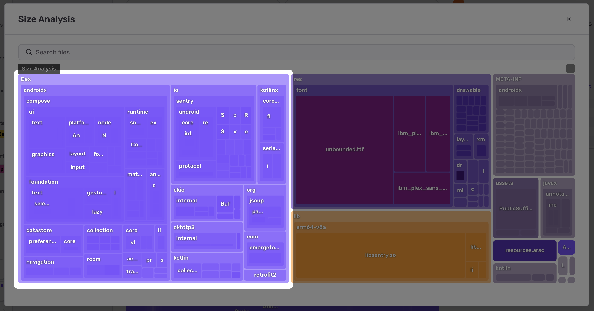

Recently one of [our](https://www.emergetools.com/blog/posts/emerge-tools-is-joining-sentry) size analysis steps went from seconds to 12 minutes. The cause was a perfect illustration of an idea coined by [Bruce Dawson](https://randomascii.wordpress.com/), a long time performance expert on all things Windows and one of my (Hector) personal heroes:

> [O(n^2) is the sweet spot of badly scaling algorithms](https://randomascii.wordpress.com/2019/12/08/on2-again-now-in-wmi/): fast enough to make it into production, but slow enough to make things fall down once it gets there.

---

## Background

We’ve been hard at work [shipping a Beta of Size Analysis](https://blog.sentry.io/monitor-reduce-mobile-app-size-analysis-early-access), binary analysis for mobile apps. Size Analysis is critical for Sentry’s future Twitter game but we also have a side line in helping customers analyze, reduce and maintain their app size. No one likes having to download 100s of megabytes over a spotty connection just to check in for a flight or [brush your teeth](https://x.com/emergetools/status/1828490449881047401).

|                                  |
| :----------------------------------------------------------------------------------------: |
| [_Future Twitter Game, visualized._](https://x.com/emergetools/status/1989379066605310341) |

A few of those customers have been kicking the tires of Size Analysis. One uncovered a problem leading to an incident.

Part of the incident was an interaction between Kafka rebalancing, the arroyo join implementation, and Python thread pools - which we’ll have to leave to another day. Instead we’ll focus on a smaller mystery: the customer's app should have taken us seconds to process but instead took over 12 minutes (before timing out), why?

## Android

In order to create the size tree map we parse the customers app and extract a hierarchy of named weighted nodes. For Android these nodes include JVM classes:



If data for symbolication is available we convert back from obfuscated names (`Lx0/p3;`) to human readable names (`io.sentry.Attachment`). This symbolication was responsible for the slowness. Parsing one of the app’s DEX files without the symbols took seconds:

```bash
$ time python -m launchpad profile-dex-parsing classes.dex

________________________________________________________
Executed in    2.36 secs    fish           external
   usr time    2.16 secs    0.09 millis    2.16 secs
   sys time    0.11 secs    4.22 millis    0.11 secs
```

But adding the symbols 40x’ed the runtime:

```bash
$ time python -m launchpad profile-dex-parsing classes.dex proguard.map

________________________________________________________
Executed in   91.80 secs    fish           external
   usr time   91.20 secs    0.07 millis   91.20 secs
   sys time    0.44 secs    1.48 millis    0.44 secs
```

The (condensed and simplified) code looked like this:

```python
class DexMapping:
  def deobfuscate_method(self, class_name, obfuscated_method_name):
    clazz = self.lookup_obfuscated_class(class_name)
    if clazz is None:
      clazz = self.lookup_deobfuscated_signature(class_name)

    if clazz is None or clazz.methods is None:
      return None

    return clazz.methods.get(obfuscated_method_name)

  def lookup_obfuscated_class(self, obfuscated_class_name):
    return self._classes.get(obfuscated_class_name)

  def lookup_deobfuscated_signature(self, deobfuscated_class_signature):
    for clazz in self._classes.values():
      if clazz.deobfuscated_signature == deobfuscated_class_signature:
        return clazz
    return None
```

Can you imagine the problem? For every class, for every method we can end up falling back to `lookup_deobfuscated_signature`. The `lookup_deobfuscated_signature` method itself iterates over every class. If we have 10 classes we can call `lookup_deobfuscated_signature` 10 times which itself could iterate over all 10 classes for 100 total. With the 52,202 classes in the customer app we end up doing >2 billion iterations in the worst case. In general the iterations (and runtime) grows with the square of the number of classes (`O(N^2)`). This grows faster than any other component and ends up dominating the total runtime.

As with many problems in Python (and very few problems in life - but don’t tempt me) the solution is simple: [more dictionaries](https://github.com/getsentry/launchpad/pull/510). The new code looks like this:

```python
class DexMapping:
  def __init__():
    self._classes_by_deobfuscated = {clazz.deobfuscated_signature: clazz for clazz in classes}

  def lookup_deobfuscated_signature(self, deobfuscated_class_signature):
    return self._classes_by_deobfuscated.get(deobfuscated_class_signature)
```

Which reduces the analysis time back to seconds:

```bash
$ time python -m launchpad profile-dex-parsing classes.dex proguard.map

________________________________________________________
Executed in    5.03 secs    fish           external
   usr time    4.73 secs    0.11 millis    4.73 secs
   sys time    0.20 secs    4.30 millis    0.19 secs
```

Once you learn about this you start seeing it everywhere. There is even a [Tumblr](http://accidentallyquadratic.tumblr.com/). This isn’t even the first time Dawson's first law _caused an incident during the Size Analysis EA!_

## iOS

Our iOS app analysis ran into a similar problem. Rather than re-write our Mach-O parsing for a third time, we decided to use an off-the-shelf library called LIEF.

Everything seemed normal in our testing until one day we got a user report of their analysis being stuck. We took a closer look and noticed that it wasn’t _stuck_, it was just taking 45 minutes to finish. Not good.

After some trial and error, we determined the slow part was happening while parsing the export trie section of the binary. As you may guess, this section packs export symbols into a more compact trie data structure to save on binary size. Many symbols contain the same prefix so this actually saves quite a bit of space. Conceptually, parsing this section should be simple, what could be going wrong?

We got our hands dirty and dug into the LIEF codebase. The code parses all of the trie items in a loop, as expected. Then, it compares the current trie node against the global list of symbols to see if it finds a match. However, there is an issue:

```cpp
auto search = memoized_symbols_.find(symbol_name);
if (search != memoized_symbols_.end()) {
  symbol = search->second;
} else {
  symbol = binary_->get_symbol(symbol_name);
}
```

The `get_symbol()` function hides a linear scan. After adding print logs to help with debugging, it became obvious the `memoized_symbols_` cache was never being used, effectively making the trie parsing logic O(n^2). Surely the cache is being populated, right? RIGHT?

Well, turns out this particular codepath forgot to populate the cache. An easy enough fix and we were able to submit a simple patch ([link](https://github.com/lief-project/LIEF/commit/7c3bf681c849ddf49c879325c424eb57570becd0)) to the project. For some reason this particular user’s binary had significantly more exported symbols than normal, seeing how this bug was able to lie dormant for almost four years (not the only recent case where an increase in data size at runtime caused [an outage due to long dormant assumptions](https://blog.cloudflare.com/18-november-2025-outage/#memory-preallocation)).

## In conclusion

In both cases:

- The code was fast all through testing…
- …in production new data caused an incident due to slowness…
- …and the root cause of that slowness was an O(n^2) algorithm.

Once the cause was in new code, once in an upstream dependency. Once the language was Python, once C++.

Bruce’s observation:

> [O(n^2) is the sweet spot of badly scaling algorithms](https://randomascii.wordpress.com/2019/12/08/on2-again-now-in-wmi/): fast enough to make it into production, but slow enough to make things fall down once it gets there.

Was right on the money.

I’m renewing my vow to be _extremely_ suspicious of O(n^2) algorithms. A common pattern is a loop which does a linear scan on each iteration. If you find yourself writing (or reading!) code which has O(n^2) runtime it is almost always worth rewriting it even if it is “fast enough” on the data you have right now.
