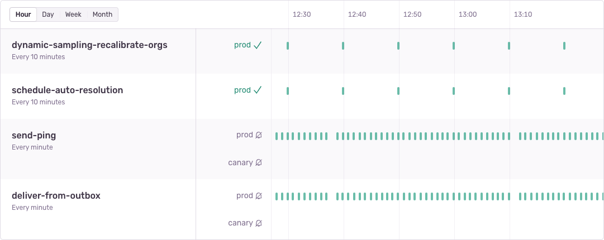
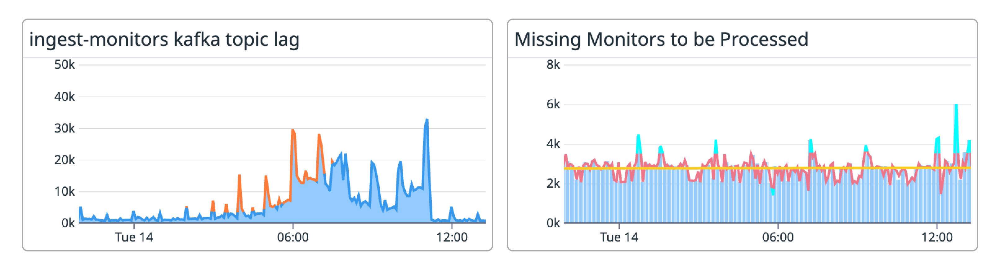

Over the past year, we’ve been building out **Crons.** A feature that started as a [small prototype](https://github.com/getsentry/sentry/commit/d27ecf09c3) which we’ve turned into a a fully-fledged feature of Sentry’s Error, Performance, and Reliability monitoring tools. While the feature itself is still in a late-stage beta, we are already accepting **over 7 million check-ins** per day. With volume like that, we’ve had to make careful decisions about the scaling architecture, specifically around how we can guarantee reliability.

# Early implementation

If you’re unfamiliar with Sentry’s new Cron Monitoring feature, it is a way to validate and be alerted in scenarios where your scheduled jobs (e.g. classic cronjobs, celery beat tasks, Sidekiq, Laravel Scheduled Tasks, or even systemd timers) are operating as usual or fail to execute. This works by your scheduled task notifying us via “check-in” events.

- **Missed:** Failing to check-in at the expected schedule will create a “missed” check-in.
- **Timed-Out:** Failing to complete an `in_progress` check-in will mark it as timed-out.
- **Error:** Sending a `status=error` check-in will mark it as explicitly errored.

In our initial prototype check-in ingestion was handled by a few API endpoints built into our Django application. Keeping things simple, check-ins are simply recorded as entries in a Postgres table. To detect missed check-ins we simply ran a celery beat task once per minute to look for monitors that did not have a check-in at the expected time. Detecting time-outs works similarly.

It wasn’t until this past year however that we took this initial prototype and turned it into something that we made available to early access users. Even as an alpha feature though, we were quick to pick up momentum, meaning it was time to think about reliability and scaling.

# Ingestion Infrastructure

The first problem we aimed to address was the ingestion of check-ins. The API endpoints that our SDKs use are highly available and distributed (using [Relay, our distributed ingestion infrastructure](https://sentry.engineering/blog/sentry-points-of-presence-how-we-built-a-distributed-ingestion-infrastructure)). The Sentry product API however, which powers our frontend and is where the prototype endpoints were implemented, does not have these same guarantees.

On top of Relay offering improved availability, another huge advantage of implementing check-ins via Relay is that we could **rapidly implement support for creating Crons check-ins across our suite of SDKs.** This is possible because Relay uses a unified [Envelope serialization schema](https://develop.sentry.dev/sdk/envelopes/) that allows SDKs to easily pass arbitrary events (with the most common of course being errors and transactions) into any Relay point of presence.

Moving Crons check-in ingestion into Relay was a no-brainer, but it was going to require a large change to the infrastructure of our prototype.

In this improved world, Relay accepts check-in events from SDKs (as well as provides an API endpoint for classical `curl` style check-ins). These check-ins are validated, normalized, and put into a Kafka topic which the Sentry Django application will consume from and do the heavy lifting of storing and processing those check-ins. This immediately gives us knobs to turn to scale up the volume of check-ins we’re able to process. Here’s what the new and improved world looks like:

With this architecture, we’re able to reliably recover from problems with our consumers while ensuring that we do not lose user check-ins. Kafka can maintain a backlog of check-ins in problematic scenarios, and we’re able to tweak the number of consumers as load demands.

# Reliably detecting missed check-ins

With availability improvements made to our ingestion infrastructure for Crons, we turned our attention to the reliability of missing check-in detection. Sentry typically works with data **as it is sent to our platform**. Detecting when things **haven’t** happened is novel territory for our infrastructure.

We quickly realized our prototype’s approach to detecting check-ins simply by using a once-per-minute celery beat task was susceptible to two major issues:

- During deploys of the celery beat scheduler, there is a short period where **tasks may be skipped**. This means our once-per-minute missing check-in producer task may sometimes fail to run for a specific minute. In this scenario, all users **will not be notified of a missed check-in** for their monitor.
- During Kafka message backlog scenarios where we’ve backlogged for more than a minute, we may produce missed check-ins for scheduled times where the successful check-in is simply in the backlog and has not yet been processed.

Both of these are not only problematic, but they are **confusing** to the end user. Our goal is to reliably tell you when your monitor has stopped running, so it is critical that missed check-ins are correctly detected.

So how can we ensure that our task to check for missing check-ins is both **1)** run for every minute of every hour of every day, indefinitely, and **2)** not susceptible to check-ins coming in later than the wall clock time?

The answer here lies in **thinking in stream time.** To ensure these tasks only run once all check-ins have been processed up to a minute boundary we need to wait for our consumer to catch up. We can do this by keeping track of the last time we crossed a minute boundary using the timestamp of the check-in for every check-in consumed. Each time we cross that boundary we know we have consumed everything up until that point. This event now becomes the trigger for our task, meaning we are cutting celery beat out of the equation entirely. In other words, we’ll no longer be skipping producing these minute tasks since we are now producing them directly from our consumers, in stream time. Solving for both mentioned issues in one go. We are using the messages themselves to drive a clock.

## The devil is in the... Kafka partitions?

While this improvement of adding a consumer-driven clock is relatively straightforward sounding, getting it right requires a little more finesse to make sure all the moving pieces work together.

As mentioned earlier, we do not have a single consumer. Having multiple consumers means that our Kafka topic must have multiple partitions (among other reasons). Each consumer reads from a set of partitions which is what allows us to horizontally scale our consumers. This sounds great, but not so great when you realize your clock needs to be synchronized across these partitions, and that the consumers can run at different speeds. Without synchronization, a scenario like this may happen, where messages are read out of order due to partitioning.

What we need to do is synchronize the clock **across all partitions.** We can do this by keeping track of the clock for each of our partitions and only moving the global clock forward once all partitions have been read up to the same time.

For a deep dive on this particular problem check out [sentry/sentry#55821](https://github.com/getsentry/sentry/issues/55821).

## Does it work

Before making this change one of the biggest problems we would often see reflected in our metrics was spikes in the creation of missed check-ins during periods of small backlogs. As described earlier, this is because we were marking expected check-in times as missed when those check-ins were simply stuck in a backlog. You can see this here.

With our changes to have the missed monitor check-ins task now dispatched from a clock driven by the consumer itself, we can see that backlogs no longer have a ripple effect that creates false positive missed check-ins. The tasks are now being dispatched **in stream time.**

# What’s next

As the Crons feature of Sentry continues to grow and more users are monitoring and being alerted on their cronjobs, we plan to continue to improve reliability. We are still tracking down subtle edge cases that can cause confusion. From [subtle timezone bugs](https://github.com/getsentry/sentry/pull/58550) to [undocumented SDK size limits](https://github.com/getsentry/sentry-python/issues/2496) there’s always more to track down and fix 🙂

Enjoyed reading this technical overview of the Crons architecture? [We’ve got openings](https://sentry.io/careers/)!
