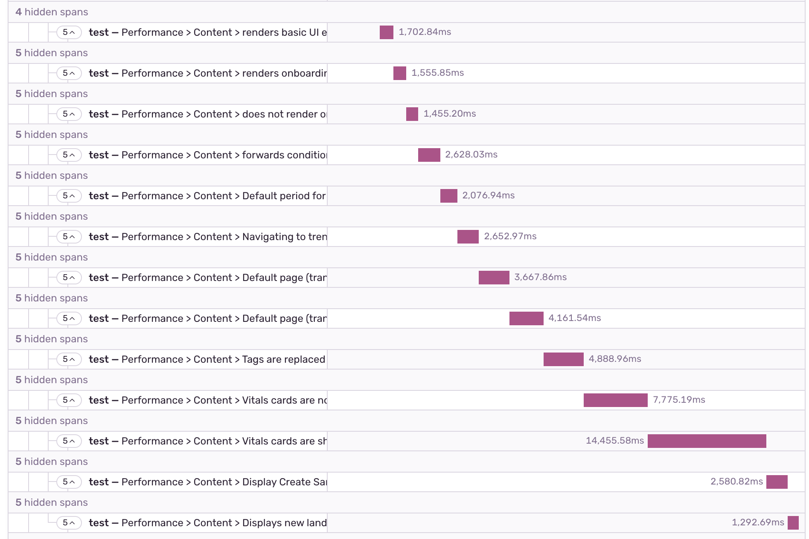
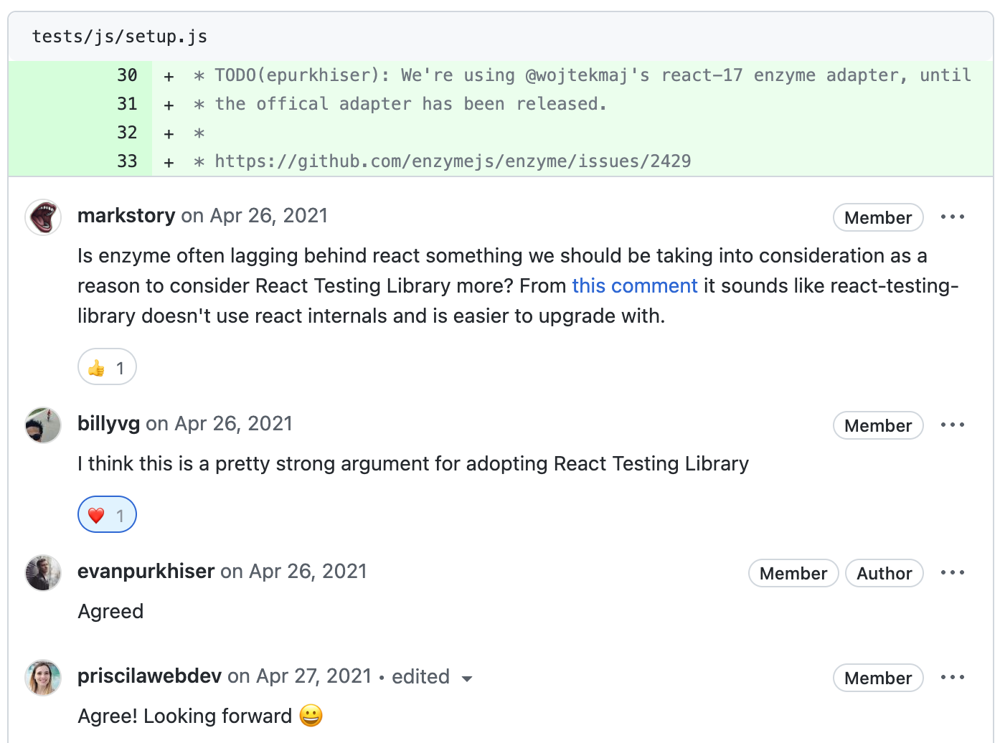
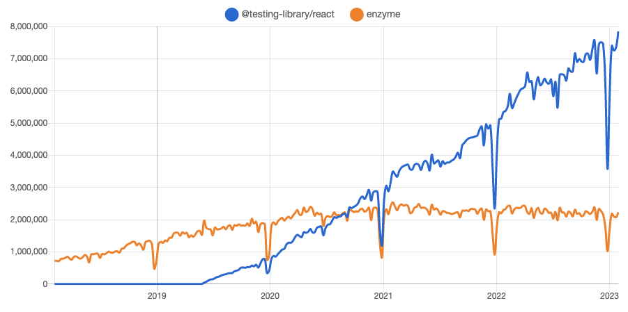
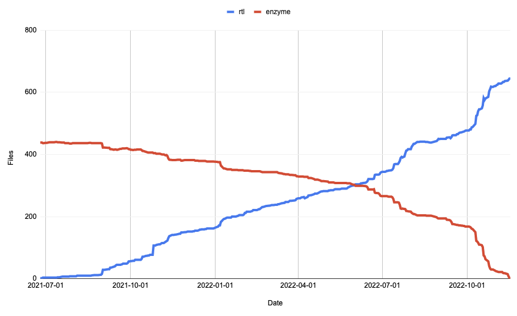
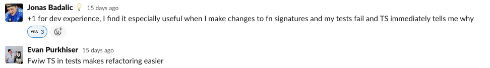
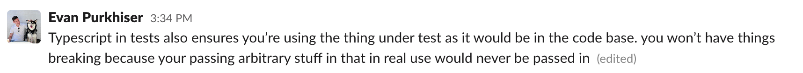

At Sentry, we practice [continuous delivery](https://blog.sentry.io/2018/07/23/modernizing-development-continuous-shipping/), which means that code can be released as soon as it’s merged into the main branch. This allows us to iterate quickly on our product, making new features, bug fixes, configuration changes, and experiments available in production as frequently as possible. We merge over 700 pull requests a month. Automated testing – particularly, automated testing of our large [React](https://sentry.io/for/react/) codebase – is a big part of our CI/CD process, helping us make sure that our product is behaving as expected.

In this post, we’ll talk about our journey converting our component tests from Enzyme to React Testing Library (aka RTL). This effort took over a year and four months, involved contributions from 17 engineers, and spanned 803 test suites and 4,937 tests, requiring changes to each one.

## What is the React Testing Library?

React Testing Library (RTL) is a react component testing library that tests components by interacting with the DOM and does not use React Internals directly like its predecessor Enzyme. RTL is currently the most popular option for testing React components, however, Sentry has been using React since before RTL was created.

## The story begins…An initial false start

We want to make sure that we’re using modern tools and practices, but we don’t just throw things in because they’re new. We carefully evaluate new technologies to understand what benefits they bring to our team. RTL was known to us back then, but we didn’t have strong arguments about why we should bring it into our codebase. Enzyme, the library we used to test our component library, was still attending to our needs.

In 2020 some engineers who have previously worked with React Testing Library joined Sentry. Based on their positive experience using the library, they brought a proposal to our Frontend Technical Steering Committee (TSC) to bring RTL into our codebase. The Frontend TSC is a group of software engineers working on Sentry’s JavaScript codebases that meet every two weeks to debate and develop best practices for the wider FE team to follow.

At the time, we were already in the midst of our huge [migration to TypeScript](https://blog.sentry.io/2021/04/12/slow-and-steady-converting-sentrys-entire-frontend-to-typescript/) and while the idea of migrating our tests to RTL sounded good and knowing that [Airbnb had transferred ownership of Enzyme to Enzyme’s new GitHub organization](https://www.infoq.com/news/2020/03/airbnb-drops-ownership-enzyme/) and was now also using RTL, we weren’t quite ready to start another migration. Despite this, we agreed that we should work on a Proof of Concept (PoC), comparing RTL with Enzyme and evaluating the benefits that this migration would bring. We were particularly interested in [performance](https://sentry.io/for/performance/) gains, as our tests at the time were very slow.



_Enzyme tests often took very long, especially if you forgot to do manual cleanup between tests. This screenshot is of Sentry’s performance product looking at Jest tests for a single component. Each test gets longer because of missing clean-up after each test._

A [proof of concept](https://github.com/getsentry/sentry/pull/18039) was created which demonstrated that the newly converted tests were slightly faster when written using RTL. However, the performance improvements - about ~12% - weren’t enough to convince us to go down the road of a long migration from Enzyme to React Testing Library. Through this proof of concept, however, we noticed that Enzyme had many downsides compared to RTL, as many of our tests in Enzyme did not test for accessibility, did not automatically clean up the test environment, and often directly accessed component state. Soon we’d find that Enzyme was also stopping us from adopting React hooks.

## React 17 forces our hand

Fast forward to April 2021, [the TypeScript migration was finally complete](https://blog.sentry.io/2021/04/12/slow-and-steady-converting-sentrys-entire-frontend-to-typescript/), and periodically a teammate would bring up React Testing Library during our TSC meetings. Often RTL was brought up when people made changes to a component’s internal state or styles and found that they also needed to update Enzymes tests, especially snapshots. This was pretty annoying and didn’t make any sense as the changes wouldn’t interfere with what the user would see on the screen.

Although optimizing developer workflow would be a good argument for migrating to RTL, the migration still didn’t get much attention until [we worked on updating React to version 17](https://github.com/getsentry/sentry/pull/25608). The React core team had completely rewritten the library’s internals and Enzyme directly used a number of internal React functionality.

One of the greatest internal improvements React 17 brought is the new JSX transform. Prior to React 17, when you write JSX code, it was transformed to a `React.createElement` call. So, it looked something like this:

```js
import React from "react";

export function App() {
  return <h1>Hello World</h1>;
}
```

And was transformed into this:

```js
import React from "react";

export function App() {
  return React.createElement("h1", null, "Hello World");
}
```

Starting on React 17, you don’t need to `import React from 'react'` anymore. Instead, two new entry points were added to the React package that were intended to be used only by compilers like Babel or TypeScript. So for the above JSX code, the output will be slightly different:

```js
import { jsx as _jsx } from "react/jsx-runtime";

export function App() {
  return _jsx("h1", { children: "Hello world" });
}
```

And you would need to write only the following in your JSX component:

```js
export function App() {
  return <h1>Hello World</h1>;
}
```

Enzyme didn’t work 100% with this new version of React, but there was an adapter on the market that worked around this problem and that’s what we used. However, this solution wouldn’t work in the long run as React 18 would require a complete rewrite, which was unlikely to happen given that Airbnb had dropped support for Enzyme.



_Pull Request updating React to version 17: https://github.com/getsentry/sentry/pull/25608_

**The benefits to migrating from Enzyme to the React Testing Library were now more clear:**

- Enzyme has no plans to support React 18. Where [RTL does not rely on React’s internals](https://github.com/enzymejs/enzyme/issues/2429#issuecomment-817750268). and would continue to work the same with React 18 as it did with 16 and 17. (note: there is [an unofficial adapter for React 18](https://www.npmjs.com/package/@cfaester/enzyme-adapter-react-18), but it is not actual, full support).
- Enzyme had only basic support for testing React Hooks.
- [An adapter](https://github.com/getsentry/sentry/blob/270b3644b36fa8b68cb004521a021758ce1c29be/tests/js/setup.js#L27-L35) for our tests to work with React would no longer be needed.
- RTL does better accessibility tests by providing role-based selectors.
- RTL avoids some of the pitfalls we ran into with Enzyme like not unmounting components between tests (slow) and directly modifying component state (poor test hygiene).
- RTL is now the more popular choice on npm for testing React components, likely because enzyme doesn’t directly support the latest version of React.



_npm downloads over time for RTL and Enzyme. RTL overtook Enzyme mid 2020_

## Estimation migration time

In 2021, we had committed to converting to RTL from Enzyme, and we had developed an agreed-upon strategy for getting it done. But, we wanted to model how much actual work this would take. Would this be a couple of weeks, a month, or a year? Would we be here converting files until the end of time? We needed to understand how large an undertaking this would be, in practice, to coordinate conversion work with our primary responsibilities – developing Sentry.

For this project, several estimates were created and one of them was classified by “File Count”, containing three projections, the first being less optimistic and the last being very ambitious. Our middle projection of 8 files per week ended up being the most accurate estimate. This put the completion date somewhere between the end of 2022 and the spring of 2023.


## Our plan of attack

We had just finished successfully converting Sentry’s entire JavaScript codebase to TypeScript. For RTL, we decided to follow a similar approach:

1. **Make it available**

We made [RTL available](https://github.com/getsentry/sentry/pull/26712) for developers to get started with and created some common data providers wrapping the test element with our required React contexts and Emotion CSS theme provider.

2. **Teach people how to use RTL**

In this transition period, many developers were inexperienced with writing tests using RTL, so we came up with the idea of organizing a virtual meeting to get together and try to convert a few tests. This experience was very positive, full of discoveries, excitement, and “Aha” moments. This was perhaps one of the coolest things we did together as a team.

Additionally, inspired by the article “[Common mistakes with React Testing Library](https://kentcdodds.com/blog/common-mistakes-with-react-testing-library)”, written by RTL’s author Kent. C Dodds, we wrote a similar document with best practices when [using React Testing Library](https://develop.sentry.dev/frontend/using-rtl/), which we could continue to document the best practices we were trying to abide by.

Frontend TSC members also set aside time to do daily code reviews. This was essential in helping those who wanted to learn how to use RTL following the best practices.

3. **All new code in React Testing Library**

At this stage we needed all new tests to be done in RTL. Otherwise, the migration would be never ending if people still wrote tests in the old style. As with our previous migration, we didn’t use any tools to prevent people from creating new tests written in Enzyme. However, one thing we did do is apply [JSDoc](https://jsdoc.app/tags-deprecated.html) `@deprecated` tags on Enzyme functions and imports, so developers would be aware they should no longer be used.

4. **Iteratively convert old code**

With all the new tests using RTL, we had a set number of files to convert, so we just needed to invest some time doing it. Encouraging developers to contribute to file conversions whenever possible and also to plan conversion tasks for their sprints was also something we incorporated.

## Unforeseen Challenges of Migrating to RTL

Once we finally understood the new mindset of RTL, everything made more sense when writing tests. The tools the library offers are pretty easy to use too, but the adoption is fraught with some non-obvious challenges.

1. **Poor performance when using `getByRole` on large components**

As per RTL’s guiding principle, tests should work the way users interact with the component. Based on this principle, [the library provides queries accessible to everyone and semantic queries](https://testing-library.com/docs/queries/about/#priority) that help us to test our components in a more accessible way.

One of these queries is the `getByRole`, which is used to query all elements exposed in the [accessibility tree](https://developer.mozilla.org/docs/Glossary/Accessibility_tree) and according to RTL this query should be our preference for just about everything.

Although `getByRole` makes a lot of sense and has motivated us a lot to make our code more accessible for users who use assistive technologies, we noticed that this query performs very poorly.

Large components that use `getByRole` selectors can be slower, and a workaround we found was to avoid calling this query multiple times by saving it to a variable or switching to `getByText` or `getByTestId` as you can see in [the pull request](https://github.com/getsentry/sentry/pull/32839#discussion_r832554205).

2. **Poor performance when using `userEvent.type` to test simulation of browser interactions**

According to Kent C. Dodds, the author of React Testing Library, we should [use userEvent over fireEvent](https://kentcdodds.com/blog/common-mistakes-with-react-testing-library#not-using-testing-libraryuser-event), affirming that `userEvent` is better because it provides several methods that more closely resemble user interactions in the browser.

We agreed with the premise of Kent’s recommendation that firing events and moving the cursor closer to the real user experience would make our tests stronger. However, after changing some tests to use `userEvent.type`, we noticed that some tests were timing out in our GitHub action environment due to the [Jest’s 5-seconds maximum](https://jestjs.io/docs/configuration/#testtimeout-number) execution time.

This was because `userEvent.type` simulates every event that happens for every character typed by a user. While this is correct and what we would like to use, due to performance issues we have replaced it with `userEvent.paste` in many of our tests and with `fireEvent` in a few places, for instance, in a [widget builder test](https://github.com/getsentry/sentry/pull/40393).

3. **Poor performance when using `userEvent.click` with many styled components in JSDOM**

When `userEvent.click` is called, it uses the `window.getComputedStyle` function to determine if the clicked element is visible and pointer events are not disabling the component. JSDOM implements a version that is similar to what runs in the browser, however, it parses all the styled-components in the component tree down to the clicked element on every `userEvent.click`.

If the element is deeply nested and the test contains many clicks it could spend a lot of time re-computing styles. [We mocked window.getComputedStyle](https://github.com/getsentry/sentry/pull/34188) with our own version based on a solution seen in [this jsdom issue](https://github.com/jsdom/jsdom/issues/3234) from mui-x. By mocking it, we traded the safety of testing styles for faster tests. One particularly slow test went from 94.93s to 47.52s from a combination of many clicks, lots of styled-components, and react-select which also uses `getComputedStyle` to place dropdowns.

4. **Missing ARIA roles on elements forced us to think harder about accessibility**

Many of our components didn’t have the proper ARIA role and the conversion motivated us to update our components so they could be selected via one of the semantic queries, as RTL recommends. However, sometimes, instead of updating a deprecated component with ARIA roles, we choose to add test IDs to be able to select it - which is faster.

There were also some ARIA attributes that we weren’t very familiar with, and sometimes we made some wrong assumptions, leading us to not use ideal ARIA labels on elements or breaking other tests when introducing them.

We were able to identify and fix many of these cases through code reviews.

5. **Converting Enzyme tests that were heavily testing the internals of a component**

Some of our tests were checking the state of a component, for instance, if the loading state was set to true, and as this was not being reflected in the DOM, it was not possible to convert this logic to RTL without having to update the frontend code.

When faced with cases like this, users would find the conversion of some files not so straightforward. On the other hand, it also helped us to improve the user experience, providing more feedback to users in the UI.

There were also many tests that no longer made sense to keep, for instance, a few [event chart tests](https://github.com/getsentry/sentry/pull/40824), so we decided to remove them.

## Keeping us motivated

Inspired by the TypeScript migration, a slack bot was created ([source code](https://gist.github.com/priscilawebdev/0d20eb221c26de1078a8cc5350fbaae5)) which, when activated, would give us the current progress and the number of files remaining to be converted. In the home stretch of the conversion, seeing the progress percentage go up every day was a great motivator booster for our team, which was always celebrated.

## We did it! Goal achieved


The end of conversion coincided with the start of our new fiscal year, so many developers slowed down the speed at which they were converting files, prioritizing product features, and quarterly planning. Even though only a few files were being converted daily, we were still making progress and slowly approaching the end of the conversion.

When we started the home stretch and the end was in sight, everyone started getting super excited again, and there were some developers who even converted the same test coincidentally.

You may recall that earlier, we forecasted that this would take 1 year and 2 months. By the project’s end, we weren’t off by that much: we finished 1 year and 4 months after our start time with 644 files using RTL at the time of completion.



## Going forward, TypeScript everywhere

During the migration, some engineers took the test conversion a step further by converting the test to TypeScript at the same time. TypeScript coupled with the language server features of an editor such as VS Code, constantly provides active hints as the code is added, something that helps to identify unnecessary or incorrect props being passed down to components and also makes the user experience much better.

[Test before conversion to RTL and TypeScript](https://github.com/getsentry/sentry/blob/414347e903b490c69dbe5115bb5572c97aab4493/static/app/views/settings/projectSecurityHeaders/projectCspReports.spec.jsx#L27-L39):

```js
it("renders", function () {
  const wrapper = mountWithTheme(
    <ProjectCspReports
      organization={org}
      // 'project' doesn't exist in the component
      project={project}
      {...TestStubs.routerProps({
        params: { orgId: org.slug, projectId: project.slug },
        location: TestStubs.location({ pathname: routeUrl }),
      })}
    />,
  );
  expect(wrapper).toSnapshot();
});
```

[Same test after conversion to RTL and TypeScript](https://github.com/getsentry/sentry/blob/9a8a22987c3b44fa57233aa6be24f586340f0cda/static/app/views/settings/projectSecurityHeaders/projectCspReports.spec.tsx#L28-L40):

```js
it("renders", function () {
  const { container } = render(
    <ProjectCspReports
      // the 'project' prop which was not required has been removed
      route={{}}
      routeParams={router.params}
      router={router}
      routes={router.routes}
      location={TestStubs.location({ pathname: routeUrl })}
      params={{ orgId: organization.slug, projectId: project.slug }}
    />,
  );
  expect(container).toSnapshot();
});
```

:

_Slack conversation 1 about TypeScript in test files_

:

_Slack conversation 2 about TypeScript in test files_

During the migration, we also had an error caused by one of the newly converted tests to RTL that could have been avoided if the file had been written in TypeScript.

Seeing that having our frontend tests typed can be very beneficial, we are aiming to go ahead and work on a plan to convert all of them to TypeScript.

## Let’s wrap it up

We’re thrilled to see all our frontend tests written in React Testing Library!

Although the performance of our tests has not improved as we had hoped, the introduction of the library has brought many other benefits, such as tests that no longer rely on implementation details, but instead test what the user sees and interacts with. And ultimately, that’s what matters.

In addition to being more confident that our tests are correct, we are also more motivated to make our application even more accessible, emphasizing one of our core values, which is to make Sentry “For Every Developer”.

This migration was truly a team effort. A major project like this always requires planning, effort, motivation, and a lot of time, all without compromising product goals. Many, many thanks to everyone who contributed to the success of this project and especially to all the engineers who, despite the many other targets they had to focus on within a sprint, always found time to convert tests.

Also here’s a big thank you to everyone who helped us with this blog. Special thanks to Ben Vinegar, Jonas Badalic, Matej Minar, and Evan Purkhiser for the countless reviews and great feedback.

Go, Team!
