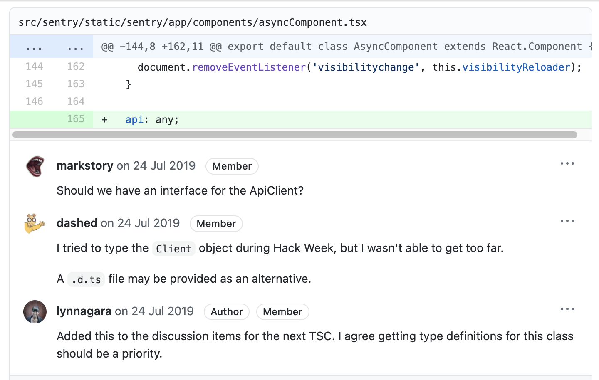
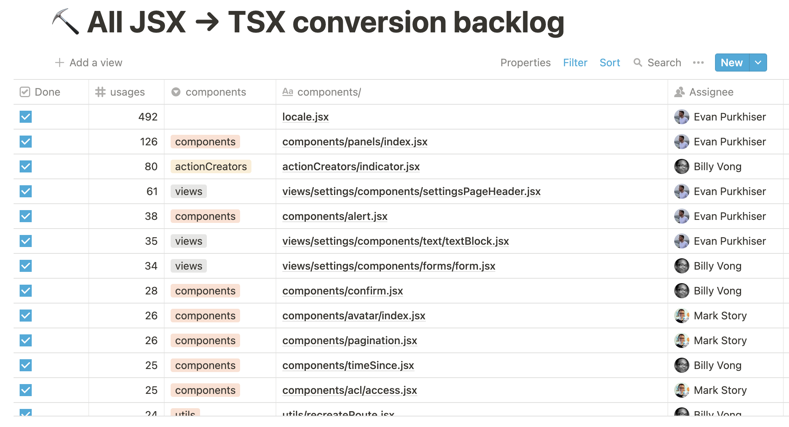
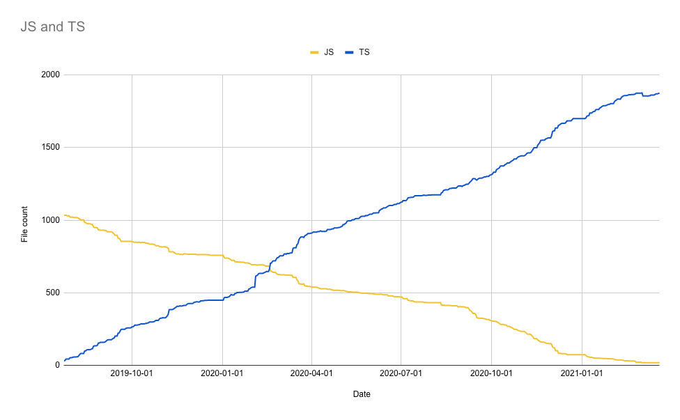

Recently, Sentry converted 100% of its frontend React codebase from JavaScript to TypeScript. This year-long effort spanned over a dozen members of the engineering team, 1,100 files, and 95,000 lines of code.

In this blog post, we share our process, techniques, challenges, and ultimately, what we learned along this journey.

## The pitch

Back in 2019, we were shipping more frontend bugs than what was acceptable. After looking at the underlying causes of these incidents, it became clear that many of these bugs could have been prevented by static analysis and type checking.

During that year’s Hackweek event, Lyn Nagara, Alberto Leal, and Daniel Griesser pitched introducing TypeScript to the Sentry frontend. This team bootstrapped the TypeScript compiler to our build process as well as converted a few non-trivial views — and their related components — to TypeScript.

_Hackweek is an event that takes place once a year, giving all Sentry employees the opportunity to set aside their usual work to focus solely on innovative projects and ideas. Hackweek has given birth to numerous applications and tools that are now important parts of our product, like the recently launched [Dark Mode project](https://blog.sentry.io/2021/04/12/slow-and-steady-converting-sentrys-entire-frontend-to-typescript/)._


_Typescript project presentation during Hackweek 2019._

After considering the presentation, we felt Typescript was a strong fit for Sentry because:

- Several classes of bugs could be detected — and eliminated — during compilation.
- We could improve the developer experience through editor integrations such as auto-completion, faster code navigation, and inline compiler feedback.
- We could reduce the need for API documentation, as type annotations help produce self-describing code.
- TypeScript has an active community with a clear and maintained development [roadmap](https://github.com/Microsoft/TypeScript/wiki/Roadmap) in addition to rapid [releases](https://github.com/microsoft/TypeScript/releases).
- Many of the libraries we use (including React) already have [type definitions](https://github.com/borisyankov/DefinitelyTyped) available.
- TypeScript can be adopted incrementally. That meant we can start writing new code with TypeScript and incrementally convert over time.

There were some potential drawbacks of adopting TypeScript, though:

- It’s a large time investment. Our frontend code is non-trivial in scope, so it would take significant effort to convert it. That complexity meant additional build time.
- We would need to educate the frontend team in TypeScript and support them as they learned.
- TypeScript and JavaScript would need to coexist in the code base for a significant period of time.

## Maturing the prototype

Shortly after Hackweek, excitement was high and a more formal proposal was brought to our Frontend Technical Steering Committee (TSC). This group meets every two weeks to guide our frontend architecture. While TypeScript wasn’t among the “winning” projects for Hackweek, we were confident that it would be a worthwhile investment that would ultimately pay off in the long run.


_[Sentry’s first Typescript Pull Request](https://github.com/getsentry/sentry/pull/13786)_

## Overall strategy

We broke our high-level strategy into several phases:

1. **Educate**. In this phase we needed to let people know that TypeScript was coming, and provide the right learning resources to help folks onboard.
2. **New code in TypeScript**. In this phase we needed to have all new development being done in TypeScript. If we continued to create new JavaScript, we would never finish the conversion phase.
3. **Conversion**. In this phase, all new work would be done in TypeScript, giving us a finite number of files to convert. Then it is “just work”™️.

Our most controversial decision was agreeing to not undergo any other major refactors until the code base was converted 100% to TypeScript. This meant we would not take on other quality-of-life improvements — things like upgrading our state-management library or introducing React hooks — until the TypeScript conversion was complete.

## Educating the team

Early on, we recognized that the broader development team at Sentry would need additional resources and materials to learn TypeScript. To help folks who were new to TypeScript, we shared a list of introductory articles and resources for configuring various editors.

Additionally, members of the TSC took the time to review code and help educate those folks eager to learn TypeScript. Having this support system in place helped create more TypeScript “believers” who would, over time, write new code in TypeScript.



_Example of a TypeScript code review._


_Slack shoutout for TypeScript conversion._

## Taking root in green fields

While we were educating the broader team, folks who were keen on TypeScript not only began building out their new feature work in TypeScript, but also found opportunities to convert files which overlapped with new features. This approach let us build up our type definitions and gain more experience writing Typescript in lower-risk parts of the product that were not exposed to customers.

As the broader team gained more experience and found value in what TypeScript provides, they naturally stopped creating more JavaScript. While we never used tooling to stop people from creating new JavaScript, our education efforts and social agreements helped prevent new JavaScript from being created.

## Work out from the core — and in from the leaves

Once TypeScript had a firm foothold, we needed a strategy to work through the 1,100+ files that needed conversion. Here, we audited our imports, ordering them by how frequently each module was imported. We used this list to prioritize which modules were converted first. By converting frequently used modules, we would be able compound our gains as we converted files.



_The list we used to prioritize and assign conversion work based on import frequency._

This approach worked well in the beginning, as some modules have dramatically more imports than others. But because most of our modules have fewer than 10 imports, we quickly plateaued. Our next approach was starting from “leaf node” modules that are imported in one place. Converting these files enabled us to accumulate progress more quickly.

## All we have to do now is convert 1,100+ files…

Like many software projects, our initial rollout plans were overly ambitious. We started off by retroactively calculating a timeline where we completed within 2019. With approximately 15 weeks before the end of the year, that meant would need to convert approximately 74 files per week. This assumed that we would not accumulate any additional JavaScript files (we did), and that we could sustain that effort (we didn’t). After eight weeks, we checked in on our progress.


_Despite promising progress during our first 8 weeks, we knew we weren’t going to finish in 2019._

It was obvious that we were not going to complete in 2019. Given projections from the current effort a more likely completion date would be mid-2020.

During the fall and winter of 2019, progress was slow. People were focusing on meeting product goals, and didn’t have as much time to devote to TypeScript conversion. In February of 2020 we reached equilibrium. We were no longer making new JavaScript and our backlog of conversion work became fixed.



_Our conversion progress over time. Note there are several lulls as well as periods of renewed activity._

## Challenges encountered

Although the introduction of TypeScript was definitely a game changer, we also faced a few challenges during the conversion process. Most of these were due to interoperability issues between TypeScript and React:

1. **Default Props**

   When using `defaultProps` on classes, TypeScript is able to correctly infer that the props are not required when using the component, but when using Higher Order Components, the types for `defaultProps` generally don’t work, and the previously optional properties would become required.

   An example of how `defaultProps` interacts poorly with Higher Order Components is:

```ts
const defaultProps = {
  statsPeriod: DEFAULT_STREAM_GROUP_STATS_PERIOD,
  canSelect: true,
  withChart: true,
  useFilteredStats: false,
};

type Props = {
  id: string;
  selection: GlobalSelection;
  organization: Organization;
  displayReprocessingLayout?: boolean;
  query?: string;
  hasGuideAnchor?: boolean;
  memberList?: User[];
  onMarkReviewed?: (itemIds: string[]) => void;
  showInboxTime?: boolean;
  index?: number;
} & typeof defaultProps

type State = {...};

class StreamGroup extends React.Component<Props, State> {
  static defaultProps = defaultProps;
  ...
}

export default withGlobalSelection(withOrganization(StreamGroup));
```

Normally, TypeScript would be able to use the `defaultProps` attribute of our class component to infer that those properties are not required. However, when wrapped in a Higher Order Component, TypeScript displays the following errors:


Here our solution was to use `Partial` on the `defaultProps` and rely on React to fill in the default values.

```ts
const defaultProps = {
    statsPeriod: DEFAULT_STREAM_GROUP_STATS_PERIOD,
    canSelect: true,
    withChart: true,
    useFilteredStats: false,
};

type Props = {
    id: string;
    selection: GlobalSelection;
    organization: Organization;
    displayReprocessingLayout?: boolean;
    query?: string;
    hasGuideAnchor?: boolean;
    memberList?: User[];
    onMarkReviewed?: (itemIds: string[]) => void;
    showInboxTime?: boolean;
    index?: number;
} & Partial<typeof defaultProps>

type State = {...};

class StreamGroup extends React.Component<Props, State> {
    static defaultProps = defaultProps;
    ...
}

export default withGlobalSelection(withOrganization(StreamGroup));
```

You can find a more complete implementation of [this approach here](https://github.com/getsentry/sentry/blob/master/src/sentry/static/sentry/app/components/stream/group.tsx).

2. **Libraries adding incorrect types**

   One downside to relying on the type definitions in DefinitelyTyped is that occasionally the library types are not written by the maintainers. Instead, community users contribute types, and because of that some types are missing or incorrectly defined. We encountered this with the versions of [ECharts](https://echarts.apache.org/en/index.html) and [Reflux](https://github.com/reflux/refluxjs) we were using. Our solution here was to add additional type definitions in our code.

3. **React.forwardRef is not compatible with generics**

   Using generic types with `React.forwardRef` is not directly possible, as it requires concrete types. In more detail, the `forwardRef` function has only one parameter named `render`. The type of this parameter is `ForwardRefRenderFunction`, which is not a generic function declaration, so higher order function type inference cannot propagate free type parameters on to the calling function `React.forwardRef`. We had to make [compromises and use “any” when this situation arose](https://github.com/getsentry/sentry/pull/23766/files).

## Sustaining motivation and energy

Toward the end of the conversion, many contributors were feeling the burning toil this project was having.

In the summer of 2020 – a full year after this project began – we crossed the 70% threshold. This revitalized folks, as we knew the end was near. We were able to sustain that energy and focus though the summer and fall by using part of our TSC meeting as a check in and collecting “conversion pledges” for the next meeting. This introduced a light-hearted social game that helped us stay focused.

In addition, our fantastic tools team introduced a slackbot that would allow us to track progress on demand. Seeing the number go up every day was a big motivator in the final stages, so much so it’s something we’ll likely to use again. You can find the early versions of that bot [here](https://github.com/getsentry/TypeScript-slack-bot).

## The end, finally


After 18 months of migrating our frontend code base to TypeScript, the day everyone at Sentry had been working toward had finally arrived. When we started on our TypeScript journey, we had 1,100+ files to convert. Now, we have over 1,915 Typescript files. It’s worth mentioning that at no time was a GitHub check added to block new JavaScript files. After developers saw the benefits that TypeScript would bring, writing new code in TypeScript was an organic choice.

With TypeScript, we now have an extra layer of protection in our code, which means we’re able to ship with greater confidence, higher productivity, and most importantly, fewer bugs. Some of our newer frontend developers have never seen a production incident caused by a frontend change.

## Looking back

Like everything in life, we also learned a few things along this journey.

1. **Incremental conversion is key**

   Our strategy to gradually migrate our files to TypeScript worked out well. We were able to balance converting our code to TypeScript, without delaying important product work. It’s important to highlight that from the beginning, we were not in a hurry to achieve our goal, but instead we wanted to proceed carefully and do a great job.

2. **Stay current with TypeScript releases**

   During our conversion process, several new releases of TypeScript came out. Each one helped us refine our types further with new features like optional chaining, nullish coalesce, named tuples, and more. While upgrading did take additional effort, the benefits were well worth it. It’s why we recommend staying as current as you can with TypeScript releases.

3. **Gradually build complex types**

   At the beginning of the migration, it was impossible to know the correct type of everything. After all, Sentry possesses a large code base, and not everyone is familiar with all parts of the application. Which meant we had to build our more complex types incrementally. As we were converting files, we became more familiar with their types and as we converted related files, we were able to better identify whether the types we had previously defined were updated with the new insights.

4. **Use TODO Comments to note future work**

   In Sentry, we generally use TODO comments in the code to help us track something we need to review later. This approach proved to be very useful during our migration to TypeScript. When we encountered an unclear type, or problematic component we would leave a `TODO(ts`) for later review. We are now incrementally reviewing the TODO list and further refining and improving our types.

```ts
import { Frame } from "app/types";

// TODO(ts): define correct stack trace type
function getRelevantFrame(stacktrace: any): Frame {
  if (!stacktrace.hasSystemFrames) {
    return stacktrace.frames[stacktrace.frames.length - 1];
  }
  for (let i = stacktrace.frames.length - 1; i >= 0; i--) {
    const frame = stacktrace.frames[i];
    if (frame.inApp) {
      return frame;
    }
  }
  // this should not happen
  return stacktrace.frames[stacktrace.frames.length - 1];
}

export default getRelevantFrame;
```

## Moving forward

Migrating to TypeScript was just the beginning. The frontend team at Sentry will continue to gradually improve types, making sure they are correct as possible, including the removal of all React PropTypes.

We’re also seriously considering introducing end-to-end type safety, so that a backend engineer can make changes in the API without unknowing breaking clients, and frontend engineers can be confident in the data that will be coming back from the server.

This important achievement would not have been possible without the patience, persistence, attention to detail, passion and hard work of everyone involved. A big thank you to all the Sentaurs who contributed to this enormous effort.
